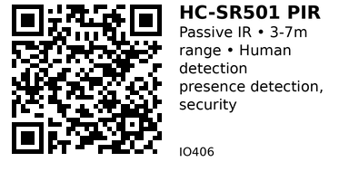

# HC-SR501 PIR Motion Sensor - IO406

Passive Infrared (PIR) motion sensor for detecting human presence. Detects infrared radiation (body heat) changes up to 7 meters away. Perfect for security systems, automatic lighting, and occupancy detection.

## Key Specifications

| Parameter | Value |
|-----------|-------|
| **Detection method** | Passive infrared (body heat) |
| **Detection range** | 3 to 7 meters (adjustable) |
| **Detection angle** | ~120° (horizontal) |
| **Output** | Digital HIGH on motion detection |
| **Supply voltage** | 4.5V - 20V (typically 5V) |
| **Current** | <50μA (standby), 80mA (triggered) |
| **Delay time** | 0.3s to 200s (adjustable) |
| **Block time** | 2.5s (non-retriggerable mode) |
| **Operating temp** | -15°C to +70°C |

## How It Works

**Passive infrared detection:**
- PIR sensor detects infrared radiation (heat)
- Fresnel lens focuses IR onto dual pyroelectric sensor
- Sensor has two elements that cancel each other
- When human moves, temperature gradient detected
- Output goes HIGH when motion detected

**Fresnel lens:**
- Multi-faceted lens on front
- Divides field of view into zones
- Motion must cross zone boundary (lateral movement)
- Direct approach may not trigger (blind spot)

## Pinout

```
HC-SR501 PIR Module (top view)
       _____
      /     \
     |  [ ]  |  Fresnel lens
     |_______|
      |     |
      | SR  |
      | 501 |
      |_____|
       | | |
       V O G
       C U N
       C T D

VCC = Power (4.5-20V, typically 5V)
OUT = Digital output (HIGH on motion)
GND = Ground

On back of module:
[POT1] = Sensitivity (detection range)
[POT2] = Time delay (how long output stays HIGH)
[JUMPER] = Trigger mode selection
```

**Jumper settings (on back):**
- **H (Repeatable):** Retriggerable - extends time on repeated motion
- **L (Non-repeatable):** Single trigger - must wait for timeout before retriggering

## Typical Wiring (ESP32)

```
ESP32           HC-SR501
-----           --------
5V     -------> VCC (or use external 5V supply)
GND    -------> GND
GPIO25 -------> OUT
```

**Note:** Some ESP32 dev boards provide 5V from USB. If not, use external 5V supply.

## Example Code (ESP32)

```cpp
// ESP32 + HC-SR501 PIR Sensor
#define PIR_PIN 25

void setup() {
  Serial.begin(115200);
  pinMode(PIR_PIN, INPUT);

  // Wait for sensor to stabilize (warm-up period)
  Serial.println("Warming up PIR sensor (60 seconds)...");
  delay(60000);
  Serial.println("PIR ready");
}

void loop() {
  int motionDetected = digitalRead(PIR_PIN);

  if (motionDetected == HIGH) {
    Serial.println("MOTION DETECTED!");
  } else {
    Serial.println("No motion");
  }

  delay(500);
}
```

## Interrupt-Based Detection

More efficient than polling:

```cpp
#define PIR_PIN 25

volatile bool motionDetected = false;

void IRAM_ATTR handleMotion() {
  motionDetected = true;
}

void setup() {
  Serial.begin(115200);
  pinMode(PIR_PIN, INPUT);

  Serial.println("Warming up...");
  delay(60000);

  attachInterrupt(digitalPinToInterrupt(PIR_PIN),
                  handleMotion,
                  RISING);  // Trigger on motion start

  Serial.println("PIR ready");
}

void loop() {
  if (motionDetected) {
    Serial.println("MOTION DETECTED!");
    motionDetected = false;

    // Perform action (turn on light, send alert, etc.)
  }

  // Do other tasks...
  delay(100);
}
```

## Automatic Lighting

```cpp
#define PIR_PIN 25
#define LIGHT_PIN 26  // Relay or LED

void loop() {
  if (digitalRead(PIR_PIN) == HIGH) {
    Serial.println("Motion - turning light ON");
    digitalWrite(LIGHT_PIN, HIGH);
  } else {
    Serial.println("No motion - turning light OFF");
    digitalWrite(LIGHT_PIN, LOW);
  }

  delay(1000);
}
```

## Security Alarm

```cpp
#define PIR_PIN 25
#define ALARM_PIN 26

bool armed = true;

void loop() {
  if (armed && digitalRead(PIR_PIN) == HIGH) {
    Serial.println("INTRUDER ALERT!");
    digitalWrite(ALARM_PIN, HIGH);  // Sound alarm
    delay(10000);  // Alarm for 10 seconds
    digitalWrite(ALARM_PIN, LOW);
  }

  delay(500);
}
```

## People Counter (Simple)

```cpp
#define PIR_PIN 25

int peopleCount = 0;
bool lastState = LOW;

void loop() {
  bool currentState = digitalRead(PIR_PIN);

  // Detect rising edge (motion start)
  if (currentState == HIGH && lastState == LOW) {
    peopleCount++;
    Serial.printf("People count: %d\n", peopleCount);
  }

  lastState = currentState;
  delay(100);
}
```

**Note:** Not accurate - PIR can't distinguish individuals. Use for rough occupancy estimate only.

## Adjusting Settings

**Sensitivity potentiometer (POT1):**
- Controls detection range
- CW (clockwise) = longer range (up to 7m)
- CCW (counter-clockwise) = shorter range (down to 3m)
- Adjust based on room size

**Time delay potentiometer (POT2):**
- Controls how long output stays HIGH after motion
- CW = longer delay (up to 200 seconds)
- CCW = shorter delay (down to 0.3 seconds)
- Adjust based on application (lighting = longer, security = shorter)

**Trigger mode jumper:**
- **H (Repeatable/Retriggerable):**
  - Motion resets timer (extends HIGH period)
  - Good for automatic lighting (stays on while moving)
  - Output stays HIGH as long as motion detected

- **L (Non-repeatable/Single trigger):**
  - Output goes HIGH for set time, then LOW
  - New trigger only after timeout + 2.5s block time
  - Good for counting events

## Calibration

**Initial setup:**
1. Power on sensor
2. Wait 60 seconds (warm-up period)
3. Adjust sensitivity pot to mid-position
4. Adjust delay pot to minimum (~3 seconds)
5. Set jumper to H (repeatable)
6. Test detection at various distances
7. Adjust sensitivity as needed

## Key Features

**Passive detection:**
- No IR emission (passive)
- Detects body heat only
- Low power consumption

**Adjustable parameters:**
- Detection range (3-7m)
- Time delay (0.3-200s)
- Trigger mode (repeatable/single)

**Wide angle:**
- ~120° horizontal coverage
- Good for room corners
- Single sensor covers large area

**Low power:**
- <50μA standby
- Perfect for battery operation
- Solar-powered applications

## Gotchas

1. **Warm-up time:** Needs ~60 seconds to stabilize after power-on
2. **Lateral motion only:** Direct approach (toward sensor) may not trigger
3. **False triggers:** Sunlight, heaters, pets, moving curtains can trigger
4. **Temperature dependent:** Less sensitive in hot environments (close to body temp)
5. **Fresnel lens:** Removing lens reduces range/angle (don't remove!)
6. **Block time:** 2.5s dead time in non-retriggerable mode
7. **Not through glass:** IR blocked by glass windows
8. **3.3V incompatible:** Needs 4.5V+ (use 5V, not 3.3V!)

## PIR vs Ultrasonic Motion Sensor

| Feature | PIR (HC-SR501) | Ultrasonic (HC-SR04) |
|---------|----------------|----------------------|
| **Detection** | Heat (infrared) | Distance (ultrasonic) |
| **Range** | 3-7m | 2-400cm |
| **Power** | Very low (~50μA) | Higher (~15mA) |
| **Through glass** | No | Yes |
| **Pets** | May trigger | May trigger |
| **Best for** | Human presence | Distance measurement |

**Use PIR when:**
- Detecting human presence
- Low power critical
- Wide angle coverage needed
- Indoor use (lighting, security)

**Use ultrasonic when:**
- Need distance measurement
- Object detection (not just humans)
- Through-glass detection needed

## Applications

**Automatic lighting:** Turn on lights when entering room.

**Security alarm:** Detect intruders, trigger alerts.

**Energy saving:** Turn off devices when room empty.

**Smart doorbell:** Detect visitor approach.

**Occupancy monitoring:** Track room usage, count entries (rough estimate).

**Wildlife camera:** Trigger camera when animal approaches.

## Troubleshooting

**Always triggered (always HIGH):**
- Sensor too sensitive (turn sensitivity CCW)
- Sunlight hitting sensor
- Heater/AC vent nearby
- Fresnel lens dirty or damaged

**Never triggers:**
- Not warmed up (wait 60 seconds)
- Wrong voltage (<4.5V won't work)
- Sensor dead
- Movement too slow or direct (try lateral movement)

**Triggers randomly:**
- Pets, insects, moving plants
- Sunlight through window
- Temperature changes (heater cycling)
- Reduce sensitivity

**Output stays HIGH constantly:**
- Delay pot set too high
- Retriggerable mode (H) with constant motion
- Reduce delay time (turn CCW)

## Mounting Tips

**Optimal placement:**
- Corner of room (120° coverage)
- Height: 2-2.5m above floor
- Angle: Point slightly downward
- Avoid: Direct sunlight, heaters, AC vents

**Outdoor use:**
- Weatherproof enclosure required
- Avoid direct rain on Fresnel lens
- Consider sunlight false triggers
- Use external 5V power supply

## Links

- **AliExpress**: Search "HC-SR501 PIR sensor" (~$1-2)

---


