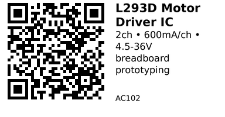

# L293D Dual H-Bridge Motor Driver IC (DIP-16) - AC102

Classic dual H-bridge motor driver IC in DIP-16 package. Perfect for breadboard prototyping and learning. Supports higher voltages than TB6612 but less efficient.

## Key Specifications

| Parameter | Value |
|-----------|-------|
| **Package** | DIP-16 (breadboard-friendly) |
| **Channels** | 2 independent H-bridges (or 1 at 1.2A) |
| **Motor voltage (VSS)** | 4.5V - 36V |
| **Logic voltage (VSS)** | 4.5V - 7V (typically 5V) |
| **Current per channel** | 600mA continuous, 1.2A peak |
| **Voltage drop** | ~2V (higher than TB6612) |
| **PWM frequency** | Up to 5kHz |
| **Built-in diodes** | Yes (flyback protection) |

## Pinout (DIP-16)

```
         L293D
    +-----------+
EN1 | 1     16 | VCC1 (Logic 5V)
1A  | 2     15 | 4A
1Y  | 3     14 | 4Y
GND | 4     13 | GND
GND | 5     12 | GND
2Y  | 6     11 | 3Y
2A  | 7     10 | 3A
VCC2| 8      9 | EN2
    +-----------+
```

### Pin Descriptions

**Power:**

- **Pin 16 (VCC1)**: Logic power supply (5V typically)
- **Pin 8 (VCC2/VSS)**: Motor power supply (4.5-36V)
- **Pins 4, 5, 12, 13 (GND)**: All GND pins must be connected

**Channel 1 (Half H-bridge 1):**

- **Pin 1 (EN1)**: Enable 1 (PWM for speed control or tie to VCC1)
- **Pin 2 (1A)**: Input 1A (direction)
- **Pin 7 (2A)**: Input 2A (direction)
- **Pin 3 (1Y)**: Output 1Y (motor +)
- **Pin 6 (2Y)**: Output 2Y (motor -)

**Channel 2 (Half H-bridge 2):**

- **Pin 9 (EN2)**: Enable 2 (PWM for speed control or tie to VCC1)
- **Pin 10 (3A)**: Input 3A (direction)
- **Pin 15 (4A)**: Input 4A (direction)
- **Pin 11 (3Y)**: Output 3Y (motor +)
- **Pin 14 (4Y)**: Output 4Y (motor -)

## Truth Table (per channel)

| EN | 1A/3A | 2A/4A | Output |
|----|-------|-------|--------|
| H | H | L | Forward |
| H | L | H | Reverse |
| H | L | L | Stop (coast) |
| L | X | X | Stop (all off) |

**Note:** Both inputs HIGH = invalid (causes shoot-through)

## Typical Wiring (ESP32)

```cpp
// Motor A (Channel 1)
#define ENA  25  // Enable/PWM
#define IN1  26  // Direction 1
#define IN2  27  // Direction 2

// Motor B (Channel 2)
#define ENB  32  // Enable/PWM
#define IN3  33  // Direction 1
#define IN4  14  // Direction 2

void setup() {
  pinMode(ENA, OUTPUT);
  pinMode(IN1, OUTPUT);
  pinMode(IN2, OUTPUT);
  pinMode(ENB, OUTPUT);
  pinMode(IN3, OUTPUT);
  pinMode(IN4, OUTPUT);

  // Setup PWM for speed control
  ledcSetup(0, 5000, 8);  // Channel 0, 5kHz, 8-bit
  ledcAttachPin(ENA, 0);
  ledcSetup(1, 5000, 8);  // Channel 1, 5kHz, 8-bit
  ledcAttachPin(ENB, 1);
}

void motorA_forward(uint8_t speed) {
  digitalWrite(IN1, HIGH);
  digitalWrite(IN2, LOW);
  ledcWrite(0, speed);
}

void motorA_reverse(uint8_t speed) {
  digitalWrite(IN1, LOW);
  digitalWrite(IN2, HIGH);
  ledcWrite(0, speed);
}

void motorA_stop() {
  digitalWrite(IN1, LOW);
  digitalWrite(IN2, LOW);
  ledcWrite(0, 0);
}
```

## Key Features

**Advantages:**

- Higher voltage support (up to 36V)
- DIP-16 package (breadboard-friendly)
- Built-in flyback diodes
- Cheap and widely available
- Good for learning

**Disadvantages vs TB6612:**

- Higher voltage drop (~2V vs ~0.5V)
- Lower efficiency (more heat)
- Lower current capacity (600mA vs 1.2A)
- Slower switching

## Gotchas

1. **Voltage drop:** Significant ~2V drop means 12V motor only gets ~10V
2. **Heat dissipation:** IC gets hot at high currents - needs heatsink or airflow
3. **All GND pins:** Connect all 4 GND pins (4, 5, 12, 13) to ground
4. **Invalid state:** Never set both direction inputs HIGH (causes shoot-through)
5. **PWM frequency:** Keep under 5kHz for best performance
6. **Current limit:** 600mA continuous - check motor stall current

## Heatsinking

At currents above 300mA per channel, consider:

- Small heatsink clipped to DIP package
- Copper pour on PCB under IC
- Fan for active cooling
- Reduce duty cycle to prevent overheating

## Compatible Motors

Good for:

- Small 6V-12V DC motors
- Breadboard prototyping
- Learning projects
- Low-current applications (<500mA)

**Not suitable for:**

- High-current motors (>600mA continuous)
- Low-voltage motors (3.7V - too much voltage drop)
- High-speed PWM (keeps frequency under 5kHz)

## Links

- **AliExpress**: [L293D Motor Driver IC](https://www.aliexpress.com/item/1005007364127814.html)
- **Datasheet**: [L293D Datasheet](https://www.ti.com/lit/ds/symlink/l293.pdf)
- **Tutorial**: [Arduino L293D Tutorial](https://www.arduino.cc/en/Tutorial/LibraryExamples/MotorKnob)

---


