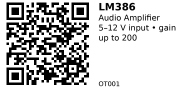

# LM386 Audio Amplifier Module - OT001

Compact mono audio power amplifier board built around the LM386 IC. Good for adding a small speaker to projects. It runs from 5–12 V and can provide modest volume for 8 Ω/4 Ω speakers. Typical voltage gain is 20 (no parts) and can be increased up to 200 with a cap between pins 1 and 8 (on most boards this is pre‑wired). Use it when you just need simple, low‑power audio without I²S.

## Links

- **Where to buy:** [AliExpress](https://www.aliexpress.com/item/1005006149377611.html)
- **Datasheet:** [Texas Instruments – LM386 PDF](https://www.ti.com/lit/ds/symlink/lm386.pdf)
- **Tutorial:** [ESP32 audio player using LM386 (CircuitDigest)](https://circuitdigest.com/microcontroller-projects/esp32-based-audio-player)

## Specifications

- Supply voltage (V\_S): 5–12 V (module rating from listing); LM386 IC operates from about 4–12 V per datasheet
- Voltage gain: 20 by default (pins 1 & 8 open); up to 200 with external cap between pins 1 & 8
- Output: mono speaker driver (suitable for small 8 Ω / 4 Ω speakers)
- On‑board input gain/volume trimmer is common on many modules (varies by board)
- Typical decoupling on board; add extra bulk capacitance if supply is noisy

*(Numbers above are conservative summaries from the AliExpress listing and the TI datasheet. Exact power output depends on supply voltage, load, and the specific module.)*

## Pinout & Addresses (common breakout labels)

Most LM386 boards expose:
- **VCC** – 5–12 V supply
- **GND** – Ground
- **IN** (or **AUDIO IN**) – AC‑coupled audio input (from ESP32 DAC or other source)
- **SPK+**, **SPK−** – Speaker output to small 8 Ω/4 Ω speaker

> Board silkscreens vary; check your PCB for exact labels.

## Wiring

Example with ESP32 DAC (GPIO25) and 5 V supply:
- **Power**: 5 V to **VCC** on the module; **GND** common between ESP32 and module.
- **Input**: ESP32 **GPIO25 (DAC1)** → (optional 10 µF series capacitor, + toward ESP32) → **IN** on the module. Tie **IN GND**/**GND** to ESP32 GND.
- **Speaker**: Connect small speaker to **SPK+**/**SPK−**.
- **Decoupling**: Add 100 µF electrolytic across VCC–GND near the module plus a 100 nF ceramic close to the pins.

## Gotchas

- Don’t power the module from the ESP32’s 3.3 V regulator—use 5–12 V. Share ground.
- Keep input leads short; long wires pick up hum and can cause oscillation.
- High gain can make it noisy; reduce gain (remove/bypass the 1–8 cap) or lower input level.
- The output is for a small speaker; it’s not a line‑out nor a high‑power amp.

## How to use

Minimal Arduino example: generate a 1 kHz tone on DAC1 (GPIO25) and feed it to the module.

```cpp
// ESP32 + LM386 demo: 1 kHz tone on DAC1 (GPIO25)
#include <Arduino.h>

const int dacPin = 25;        // DAC1
const int sampleRate = 20000; // 20 kHz
const float freq = 1000.0f;   // 1 kHz
const uint8_t amplitude = 120; // 0..255 (keep moderate)
const uint8_t offset = 128;    // center for DAC

void setup() { }
void loop() {
  static uint32_t n = 0;
  float t = (float)n / sampleRate;
  uint8_t v = offset + (uint8_t)(amplitude * sinf(2.0f * PI * freq * t));
  dacWrite(dacPin, v);
  n++;
  // delay to set sample rate
  delayMicroseconds(1000000 / sampleRate);
}
```

Libraries: none (uses built‑in `dacWrite`). For better audio, consider I²S DAC/amps.

---

*QR for printing will appear here after you run the script:*


