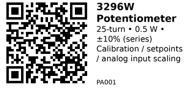

# 3296W Trimmer Potentiometers — IO101

**Aliases:** Bourns‑style 3296W (multiturn cermet trim pot, top‑adjust)  
**Package:** 3/8″ square, sealed cermet (through‑hole)

## Quick Facts
- **Adjustment:** 25‑turn, **top‑adjust** (slot).  
- **Power rating (series):** **0.5 W** at 70 °C (derates to 0 W at 125 °C).  
- **Resistance tolerance (series):** **±10%** (typical for many 3296 variants).  
- **Tempco (series):** typically **±100 ppm/°C**.  
- **Terminals:** 3 pins in‑line — **1** (end), **2** (wiper), **3** (end). Rotation is **clockwise to increase** resistance between wiper and terminal 1 per series drawing.

> **Working voltage** is limited by power:  \\(V_{max} \approx \sqrt{P_{rated}\cdot R}\\). Keep the wiper current low and stay within series ratings.

## What’s in this kit (26 pcs, 13 values × 2 each)
**100 Ω, 200 Ω, 500 Ω, 1 kΩ, 2 kΩ, 5 kΩ, 10 kΩ, 20 kΩ, 50 kΩ, 100 kΩ, 200 kΩ, 500 kΩ, 1 MΩ** (all 3296W form factor).

## Links
- **Where to buy:** [AliExpress](https://www.aliexpress.com/item/1005006430362522.html)
- **Datasheet (series):** [Bourns 3296 Trimpot](https://www.bourns.com/docs/product-datasheets/3296.pdf)
- **General note:** This kit is a clone/compatible set; mechanical and most electrical characteristics follow the 3296 series norms, but minor differences can exist across vendors.

## Pinout & Orientation
- **1 – End**, **2 – Wiper**, **3 – End** (inline). The 3296**W** variant is **top‑adjust**; 3296**X** is side‑adjust (same electrical function).

## Typical uses
- Calibrating sensor bridges and op‑amp gains/offsets  
- Setting thresholds (comparators), RC timing trims  
- Creating a **voltage divider** for a microcontroller **ADC** (e.g., ESP32)

## Wiring example (ESP32 ADC)
**Voltage divider (recommended):**  
- **3.3 V → pin 1**, **GND → pin 3**, **ADC input → pin 2 (wiper)**  
- ESP32 reads **0–3.3 V** as **0–4095** (12‑bit). The ESP32 ADC is somewhat non‑linear; for precision, apply calibration or a LUT.

```cpp
// ESP32 + 3296W as a simple ADC knob (Arduino IDE)
// Connect: 1→3.3V, 3→GND, 2 (wiper) → GPIO34 (ADC1_CH6)
const int ADC_PIN = 34;

void setup() {
  Serial.begin(115200);
  analogReadResolution(12);      // 0..4095
  // analogSetPinAttenuation(ADC_PIN, ADC_11db); // optional
}

void loop() {
  int raw = analogRead(ADC_PIN);
  float v = (raw / 4095.0f) * 3.3f;  // approx conversion
  Serial.printf("raw=%d  ~V=%.3f\n", raw, v);
  delay(200);
}
```

## Notes & gotchas
- **Power limit:** Don’t drop significant voltage at high resistance with appreciable current—check \\(P=I^2R\\) and \\(V^2/R\\).  
- **Wiper as output:** Avoid large wiper current (use as a divider feeding a high‑impedance input).  
- **Adjustment range:** 25‑turn gives fine control; if you reach an end‑stop, reverse a few turns—don’t force it.  
- **Variant naming:** 3296**W** = **top adjust**; 3296**X** = side adjust (mechanical variant). Electrical ratings are shared across the 3296 series.

---

*QR for printing will appear here after you run your sticker script:*


