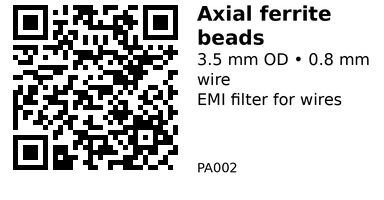

# Axial ferrite beads 3.5×8/9×0.8 - PA002

Small axial ferrite beads used as simple EMI filters on power or signal lines.  
You slide the bead over a lead or wire to add impedance at high frequency, helping to tame noisy modules, long sensor cables, or wires going in and out of your project enclosure.

They are generic unbranded parts from Javino; use them whenever you want a cheap way to reduce high‑frequency noise without changing your PCB.

## Links

- **Where to buy:** [AliExpress](https://www.aliexpress.com/item/10000063621565.html)
- **Tutorial:** [Choosing and Using Ferrite Beads (AllAboutCircuits)](https://www.allaboutcircuits.com/technical-articles/choosing-and-using-ferrite-beads/)

## Specifications

From the AliExpress listing (generic ferrite cores):

- Type: axial ferrite bead / inductor bead
- Quantity: ~50 pcs per lot
- Outer diameter (OD): 3.5 mm
- Inner diameter (wire hole): 0.8 mm
- Height (length along the wire): 8–9 mm
- Material: ferrite core
- Color: may vary between batches (image is illustrative only)

There is no guaranteed inductance or impedance curve provided for this generic assortment – treat them as “good enough” EMI beads rather than precision components.

## Pinout & Addresses (common breakout labels)

Not applicable – these are bare beads with no pins or markings.

Usage is purely mechanical:

- Slide the bead over a wire or component lead.
- Optionally loop the wire through the bead more than once to increase the effective impedance at high frequency.

## Wiring

Typical ways to use these beads with an ESP32 (or any MCU):

1. **On a noisy peripheral’s supply line**

   - Put the bead in series with the **V+** wire going to a noisy module (e.g. small DC motor driver, relay board, etc.).
   - On the ESP32 side of the bead, place a decoupling capacitor (e.g. 100 nF, possibly plus a larger electrolytic) from V+ to GND.
   - This forms a simple low‑pass filter: the bead resists high‑frequency noise, and the capacitor shunts it to ground.

2. **On long sensor cables**

   - Thread the sensor cable’s power (and optionally signal) conductor through a bead near the board end.
   - This can help reduce RF noise picked up by long wires, improving ADC readings or avoiding random resets.

3. **On USB or power leads**

   - You can slide a bead over the 5 V feed to a small board as a basic EMI suppression measure.
   - For better effect, loop the wire through the bead multiple times if the geometry allows.

Because these are loose beads, you normally use them on **flying leads** or you solder the wire+bead assembly into a through‑hole footprint on a PCB.

## Gotchas

- **Not a precision inductor:** These beads are for EMI suppression, not for tuned LC filters or precise inductance values.
- **Frequency‑dependent:** They mainly affect high‑frequency noise (RF range). They will not fix low‑frequency ripple or sagging power rails.
- **No specified current rating:** As generic parts, there is no guaranteed current spec. For small ESP32‑scale projects they are usually fine, but avoid using them in high‑current paths without testing.
- **Assortment variability:** Dimensions and ferrite mix may vary slightly between batches; don’t rely on exact performance.

## How to use

There is no code required – these beads are purely hardware components.

General usage pattern:

1. Identify a noisy or sensitive line (e.g. 5 V feeding a motor driver, long sensor cable, etc.).
2. Cut that line and insert the bead in series by sliding it over the wire or lead.
3. Add a decoupling capacitor on the MCU side of the bead when filtering power.
4. Test the circuit (e.g. check for fewer resets, less noise on ADC readings, less EMI).

You can combine these beads with good layout and grounding practices for best results.

---

*QR for printing will appear here after you run the script:*

