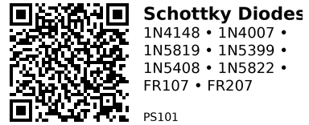

# Schottky Diode Kit (8 Values) — PS101

**Includes:** 1N4148, 1N4007, 1N5819, 1N5399, 1N5408, 1N5822, FR107, FR207  
**Category:** PS (Power / protection parts)  
**AliExpress listing:** [8 Values 100PCS Diode Kit](https://www.aliexpress.com/item/1005008790810897.html)

> **What this kit is for:** A small set that covers *signal* switching, *power* rectification, *low-loss Schottky* needs, and *fast recovery* for PWM/switching supplies. You reach for a **diode** whenever you need current to flow only one way, to turn AC into DC, to protect against reverse polarity, or to safely absorb energy from an inductive load (motors, relays, solenoids).

---

## Quick Selection Cheatsheet

- **Relay/solenoid flyback @ 5–24 V:** 1N4007 (OK), **FR107** (better for fast PWM), **1N5819/1N5822** (Schottky, low drop, cool).
- **Motor freewheel (PWM):** **FR107/FR207** or **1N5822** (Schottky 3 A). Avoid slow 1N4007 at high PWM.
- **Reverse‑polarity input protection (low current):** 1N5819 (≤1 A) or 1N5822 (≤3 A) for low loss; 1N4007 okay if drop isn’t critical.
- **Bridge rectifier for small adapters (≤1 A):** 1N4007 (x4). For 1.5–3 A use 1N5399/1N5408 (x4).
- **Signal steering / logic / clamp:** **1N4148** (fast small‑signal).  
- **High‑voltage rectification:** 1N4007 (1000 V), 1N5399 (1.5 A • 1000 V), 1N5408 (3 A • 1000 V), FR107/FR207 (fast • 1000 V).

---

## What’s in the kit (specs & typical uses)

| Part     | Type                | If rating | Vr (V_RRM) | Vf @ rated If | Speed (approx) | Typical uses |
|----------|---------------------|-----------|------------|---------------|----------------|--------------|
| **1N4148** | Small‑signal switching | 150 mA   | 100 V      | ~1.0 V @ 10 mA | **Very fast** (ns) | Logic steering, clamp, small signal paths, RC discharge, speed‑ups |
| **1N4007** | Rectifier (standard)   | 1 A      | **1000 V** | ~0.95 V @ 1 A  | **Slow** (µs)     | Bridges up to ~1 A, DC input protection, relay flyback (non‑PWM) |
| **1N5819** | **Schottky**          | 1 A      | 40 V       | **~0.2–0.45 V** | Fast (ns–tens ns) | Low‑drop reverse protection, buck/boost catch diode ≤1 A, motor flyback at low V |
| **1N5399** | Rectifier (standard)   | 1.5 A    | **1000 V** | ~0.95–1.1 V     | Slow (µs)         | Bridges/regulation around 1–1.5 A, chargers |
| **1N5408** | Rectifier (standard)   | **3 A**  | **1000 V** | ~1.0–1.2 V       | Slow (µs)         | Mains bridge rectifier, 2–3 A loads |
| **1N5822** | **Schottky**          | **3 A**  | 40 V       | **~0.35–0.55 V** | Fast (ns–tens ns) | Low‑loss high‑current catch diode, reverse protection up to ~3 A |
| **FR107**  | **Fast‑recovery**      | 1 A      | **1000 V** | ~0.95 V @ 1 A    | **Fast** (~500 ns) | PWM freewheel, SMPS secondary, better flyback for high‑speed switching |
| **FR207**  | **Fast‑recovery**      | **2 A**  | **1000 V** | ~1.0–1.2 V       | **Fast** (~500 ns) | Like FR107 but more current; motor/solenoid PWM, beefier catch diode |

**Notes:**  
- *If* = average forward current at 25 °C with adequate heatsinking. Peak/surge currents are higher but short‑lived.  
- Schottkys have **low Vf** and **no reverse recovery “tail”**, but higher **reverse leakage** that rises with temperature.  
- “Vr (V_RRM)” is the **maximum repetitive reverse voltage**; stay well below with margin (see sizing, below).

---

## Where to use which (practical scenarios)

### 1) Relay/solenoid “flyback” protection
When you turn off an inductor, it tries to keep current flowing and can spike your MOSFET/MCU. Place the diode **across the coil**, **cathode to +**, **anode to −**.

```
+V ----[coil]----+----> to driver
                 |
                 | |<|  diode (cathode at +V)
                 |
GND -------------+
```

- **Slow switching (on/off):** 1N4007 is fine.  
- **Fast PWM drive:** choose **FR107/FR207** or **Schottky (1N5819/1N5822)** to reduce recovery losses and coil “ring”.

### 2) DC input reverse‑polarity protection
Put a diode **in series** with the + input (simple) or **across** the input with a fuse (lower drop in normal operation with Schottky + fuse).

- **Series diode:** 1N5819 (≤1 A) or 1N5822 (≤3 A) to minimize voltage drop/heat.  
- **Shunt + fuse:** 1N5408 for robust sacrifice‑mode (blows fuse on reverse).

### 3) Power OR‑ing (choose the highest supply, block back‑feed)
- Low‑current: two **1N5819** from each source to the load.  
- Higher current: **1N5822** pair. (For ultra‑low loss, ideal‑diode MOSFETs are better, but diodes are simple and robust.)

### 4) Bridge rectifier (AC → DC)
Use **four identical diodes**. Size by **load current** and **reverse voltage** (Vr ≥ 2× Vac_rms × 1.414).  
- Up to ~0.7–0.8 A: **1N4007** bridge.  
- ~1–1.3 A: **1N5399**.  
- ~2–3 A: **1N5408**.

### 5) Buck/boost “catch” diode
- Up to ~1 A: **1N5819** (Schottky).  
- Up to ~3 A: **1N5822**.  
Avoid slow 1N400x here; switching losses and reverse recovery heating will be large.

### 6) Signal‑level tasks
- **Clamp small transients, level steering, RC discharge, SPI/I²C speed‑up networks:** **1N4148**.  
- For ESD‑class surges use **TVS** diodes (not in this kit).

---

## Polarity & Symbols

- **Stripe = Cathode (K)**, **no stripe = Anode (A)**. Current flows **A → K**.  
- On schematics, the triangle‑bar symbol (for diodes in general) points from **A** to **K**. For Schottky, the symbol looks similar but may have an ‘S’ or unique style.

---

## Sizing Rules of Thumb

1. **Reverse voltage margin:** choose **Vr ≥ 2×** the highest DC you’ll see (or **≥ 3×** the peak of any ringing spikes).  
2. **Current:** the *average* forward current should be ≤ **50–70 %** of the diode’s rated **If** at your ambient.  
3. **Vf & heat:** power loss ≈ **Vf × I_avg**. Schottky saves heat at low voltages.  
4. **Speed matters:** for PWM/switching supplies use **Schottky** or **fast‑recovery**. Slow 1N400x diodes are fine for mains/low‑frequency rectification but run hot in switchers.  
5. **Temperature:** Schottky **leakage rises** with temperature; ensure reverse leakage × Vr doesn’t cause runaway in hot environments.

---

## Gotchas

- **Wrong orientation** destroys parts. Check the **stripe (K)**.  
- **Using 1N400x in high‑frequency circuits** → heating and noise due to reverse recovery.  
- **Schottky leakage** can upset very low‑power systems when reversed; consider standard diodes if leakage matters.  
- **Voltage spikes** from inductors can exceed Vr; add **RC snubbers** or **TVS** if needed.  
- **Bridge rectifiers** drop about **2×Vf**; ensure headroom for regulators.

---

*QR for printing will appear here after you run the script:*



