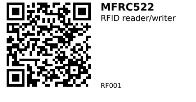

# MFRC522 RFID Reader/Writer Module — RF001

**Aliases:** RC522 / MFRC522 (various vendors)
**Category:** RF (Radios / comms)

## Quick Facts
- **Chip:** NXP MFRC522 (13.56 MHz)
- **Tags supported:** **MIFARE Classic (1K/4K)** and compatible. *Does **not** support NTAG I²C/Ultralight/DesFire/Plus features.*
- **Interface:** **SPI** (3.3 V logic)
- **Range:** Typically **2–5 cm** with the small PCB antenna module.
- **Supply:** 3.3 V (most breakout boards include a 3.3 V regulator; avoid 5 V on logic).

## Links
- **Where to buy:** [AliExpress](https://www.aliexpress.com/item/1005008809242865.html)
- **Tutorial:** [Random Nerd Tutorials](https://randomnerdtutorials.com/esp32-mfrc522-rfid-reader-arduino/)

## Pinout (module → ESP32 VSPI default)
- **SDA/SS** → **GPIO 5** (chip select, any free GPIO is fine)
- **SCK** → **GPIO 18**
- **MOSI** → **GPIO 23**
- **MISO** → **GPIO 19**
- **RST** → **GPIO 22**
- **3.3V** → **3V3**
- **GND** → **GND**

> If you use different SPI pins, adjust `SPI.begin(SCK,MISO,MOSI,SS)` and the `MFRC522` constructor accordingly.

## Gotchas
- **Tag type matters:** Examples below assume a **MIFARE Classic 1K** tag. NTAG/Ultralight ≠ Classic (different auth & memory model).
- **Keys:** New Classic cards usually ship with **Key A = FF FF FF FF FF FF**. Change keys for security.
- **Block math:** Sector 0 contains the UID; **block 0 is read‑only** on most tags. Use blocks **4–62** (1K) for user data, skipping trailer blocks (sector trailers at block numbers `% 4 == 3`).
- **Power & range:** Keep wires short, avoid USB hub noise, and don’t put metal behind the antenna.

---

## Code — Read UID and (optionally) dump a data block

**Libraries needed:**  
- **MFRC522** by Miguel Balboa (Library Manager)  
- **Arduino** core for ESP32

```cpp
// RF001: MFRC522 Read Example (ESP32)
// Reads card UID and optionally dumps block 4 (first user block on Classic 1K)
#include <SPI.h>
#include <MFRC522.h>

// SPI pins (VSPI). Adjust if needed.
static const int SS_PIN  = 5;   // SDA/SS
static const int RST_PIN = 22;  // RST

MFRC522 rfid(SS_PIN, RST_PIN);   // Create MFRC522 instance
MFRC522::MIFARE_Key key;

void setup() {
  Serial.begin(115200);
  while (!Serial) { delay(10); }

  SPI.begin(18, 19, 23, SS_PIN);
  rfid.PCD_Init();

  // Initialize key (default FFFFFFFFFFFF)
  for (byte i = 0; i < 6; i++) key.keyByte[i] = 0xFF;

  Serial.println(F("MFRC522 ready. Present a MIFARE Classic tag..."));
}

void loop() {
  // Look for new cards
  if (!rfid.PICC_IsNewCardPresent() || !rfid.PICC_ReadCardSerial()) {
    delay(50);
    return;
  }

  // Print UID
  Serial.print(F("UID: "));
  for (byte i = 0; i < rfid.uid.size; i++) {
    if (rfid.uid.uidByte[i] < 0x10) Serial.print('0');
    Serial.print(rfid.uid.uidByte[i], HEX);
    Serial.print(i + 1 < rfid.uid.size ? ':' : '\n');
  }

  // Select tag type
  MFRC522::PICC_Type piccType = rfid.PICC_GetType(rfid.uid.sak);
  Serial.print(F("Type: "));
  Serial.println(rfid.PICC_GetTypeName(piccType));

  // Only proceed on MIFARE Classic
  if (piccType != MFRC522::PICC_TYPE_MIFARE_MINI &&
      piccType != MFRC522::PICC_TYPE_MIFARE_1K &&
      piccType != MFRC522::PICC_TYPE_MIFARE_4K) {
    Serial.println(F("This tag is not MIFARE Classic."));
    rfid.PICC_HaltA();
    rfid.PCD_StopCrypto1();
    return;
  }

  // Authenticate and read block 4
  byte block = 4; // first data block in sector 1 (safe user data block)
  byte buffer[18];
  byte size = sizeof(buffer);

  MFRC522::StatusCode status;
  status = rfid.PCD_Authenticate(MFRC522::PICC_CMD_MF_AUTH_KEY_A, block, &key, &(rfid.uid));
  if (status != MFRC522::STATUS_OK) {
    Serial.print(F("Auth failed: "));
    Serial.println(rfid.GetStatusCodeName(status));
  } else {
    status = rfid.MIFARE_Read(block, buffer, &size);
    if (status == MFRC522::STATUS_OK) {
      Serial.print(F("Block 4: "));
      for (byte i = 0; i < 16; i++) {
        if (buffer[i] < 0x10) Serial.print('0');
        Serial.print(buffer[i], HEX);
        Serial.print(i < 15 ? ' ' : '\n');
      }
    } else {
      Serial.print(F("Read failed: "));
      Serial.println(rfid.GetStatusCodeName(status));
    }
  }

  // Cleanup
  rfid.PICC_HaltA();
  rfid.PCD_StopCrypto1();
}
```

---

## Code — Write 16 bytes to a data block and verify

**What it does:** waits for a Classic tag, authenticates **block 4** with **Key A = FF...FF**, writes `"Hello from ESP32!"` (16 bytes), then reads back.

```cpp
// RF001: MFRC522 Write Example (ESP32)
// Writes 16 bytes to block 4 on a MIFARE Classic tag, then reads it back
#include <SPI.h>
#include <MFRC522.h>

static const int SS_PIN  = 5;   // SDA/SS
static const int RST_PIN = 22;  // RST

MFRC522 rfid(SS_PIN, RST_PIN);
MFRC522::MIFARE_Key key;

// 16-byte payload (exactly one block)
byte dataBlock[16] = { 'H','e','l','l','o',' ','f','r','o','m',' ','E','S','P','3','2' };

void setup() {
  Serial.begin(115200);
  while (!Serial) { delay(10); }

  SPI.begin(18, 19, 23, SS_PIN);
  rfid.PCD_Init();

  for (byte i = 0; i < 6; i++) key.keyByte[i] = 0xFF;

  Serial.println(F("Place a MIFARE Classic tag to WRITE block 4..."));
}

void loop() {
  if (!rfid.PICC_IsNewCardPresent() || !rfid.PICC_ReadCardSerial()) {
    delay(50);
    return;
  }

  MFRC522::PICC_Type piccType = rfid.PICC_GetType(rfid.uid.sak);
  if (piccType != MFRC522::PICC_TYPE_MIFARE_MINI &&
      piccType != MFRC522::PICC_TYPE_MIFARE_1K &&
      piccType != MFRC522::PICC_TYPE_MIFARE_4K) {
    Serial.println(F("Not a MIFARE Classic tag."));
    rfid.PICC_HaltA();
    rfid.PCD_StopCrypto1();
    return;
  }

  byte block = 4; // safe user block
  MFRC522::StatusCode status;

  // Authenticate
  status = rfid.PCD_Authenticate(MFRC522::PICC_CMD_MF_AUTH_KEY_A, block, &key, &(rfid.uid));
  if (status != MFRC522::STATUS_OK) {
    Serial.print(F("Auth failed: "));
    Serial.println(rfid.GetStatusCodeName(status));
    haltTag();
    return;
  }

  // Write 16 bytes
  status = rfid.MIFARE_Write(block, dataBlock, 16);
  if (status != MFRC522::STATUS_OK) {
    Serial.print(F("Write failed: "));
    Serial.println(rfid.GetStatusCodeName(status));
    haltTag();
    return;
  }
  Serial.println(F("Write OK. Reading back..."));

  // Read back
  byte buffer[18];
  byte size = sizeof(buffer);
  status = rfid.MIFARE_Read(block, buffer, &size);
  if (status != MFRC522::STATUS_OK) {
    Serial.print(F("Readback failed: "));
    Serial.println(rfid.GetStatusCodeName(status));
  } else {
    Serial.print(F("Block 4 now: "));
    for (byte i = 0; i < 16; i++) {
      Serial.write(isPrintable(buffer[i]) ? buffer[i] : '.');
    }
    Serial.println();
  }

  // Done with this card
  haltTag();
}

void haltTag() {
  rfid.PICC_HaltA();
  rfid.PCD_StopCrypto1();
}
```

### Choosing a block safely
- On 1K cards, sectors are 4 blocks (0–3, 4–7, …). **Sector trailer** is every 4th block: 3, 7, 11, … **Never write trailers** unless you know what you’re doing.
- Start with blocks **4, 5, 6**. Avoid **block 0** (contains UID; read‑only).

### Changing keys (optional)
Look into `MIFARE_Write()` on the **sector trailer** layout (Key A, access bits, Key B). Keep a backup—bad access bits can permanently lock a sector.

---

## Typical Use Cases
- Keyless drawer/locker projects, toy access control, attendance punches
- Tagging boxes/tools with quick binary or short text data (16 B per block)
- Triggering actions when a known UID is presented (Home Assistant, MQTT, etc.)

---


*QR for printing will appear here after you run the script:*


