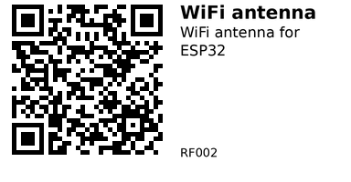

# 2.4 GHz WiFi antenna + U.FL pigtail - RF002

Low-gain 2.4 GHz omnidirectional WiFi antenna with an RP‑SMA male connector, plus a short U.FL/IPX‑to‑RP‑SMA pigtail cable.  
Use it to add an external WiFi antenna to ESP32 boards or other 2.4 GHz devices that expose a U.FL/IPX antenna connector, or to replace/extend the antenna on small WiFi routers and access points.

This set is useful when you need slightly better range, a more convenient antenna position (e.g. outside an enclosure), or when the on-board PCB antenna is blocked by metal, batteries, or other hardware.

## Links

- **Where to buy:** [AliExpress](https://www.aliexpress.com/item/1005008490414283.html)
- **Datasheet:** Not available (generic antenna + cable set)

## Specifications

**Antenna (RP‑SMA):**

- Frequency band: 2.4 GHz WiFi
- Advertised gain: 2–3 dBi (low‑gain omni)
- Type: Omnidirectional whip antenna
- Connector: RP‑SMA male (female pin)
- Color: Black
- Approx. length: 11 cm

**Pigtail cable (RP‑SMA to U.FL/IPX):**

- Series: RP‑SMA to U.FL/IPX coaxial pigtail
- Connector 1: RP‑SMA jack, male pin (mates with the antenna’s RP‑SMA male)
- Connector 2: U.FL/IPX plug (for RF modules / dev boards)
- Approx. length (including connectors): 17 cm
- Cable type: 1.13 coaxial cable (very thin, flexible RF cable)

This is a general‑purpose 2.4 GHz WiFi antenna + pigtail kit. Exact RF performance will vary, but you can treat it as a small, low‑gain omni antenna suitable for short‑to‑medium range.

## Pinout & Addresses (common breakout labels)

There are no digital pins or addresses here, only RF connectors:

- **RP‑SMA male (antenna):**
  - Screws onto an **RP‑SMA jack (female body, male pin)** on the device or pigtail.
  - Used purely for RF, 50 Ω impedance at 2.4 GHz (no power/data pins).

- **RP‑SMA jack, male pin (on the pigtail cable):**
  - Mates with the antenna’s RP‑SMA male connector.
  - Carries the RF signal from cable to antenna.

- **U.FL / IPX plug (on the pigtail):**
  - Tiny snap‑on connector that mates with U.FL/IPX socket on the ESP32 module or WiFi board.
  - Very small and fragile: align carefully and press straight down.

No I2C/SPI/UART addresses: this is a purely passive RF part.

## Wiring

Typical use with an ESP32 dev board that supports an external antenna:

1. **Check your board:**  
    - Look for a tiny **U.FL/IPX connector** near the ESP32 module, or a solder‑jumper / switch labeled something like `ANT`, `EXT_ANT`, or `PCB / EXT`.
    - Many cheap dev boards do **not** expose U.FL, so this kit will only be directly usable with boards/modules designed for external antennas.

2. **Select the external antenna path (if needed):**  
    - Some boards have a small 0 Ω resistor or solder bridge to choose between PCB antenna and U.FL connector.  
    - Move the resistor / change the jumper so the RF path goes to **U.FL** rather than the PCB antenna (follow the board’s silkscreen / documentation).

3. **Attach the pigtail:**  
    - Carefully align the **U.FL/IPX** connector with the socket on the board.  
    - Press straight down until it clicks. Avoid twisting or pulling on the cable.

4. **Attach the antenna:**  
    - Screw the **RP‑SMA antenna** onto the pigtail’s RP‑SMA jack. Finger‑tight is enough; don’t over‑tighten.

5. **Position the antenna:**  
    - Keep the antenna outside metal enclosures and not pressed directly against large ground planes or batteries.  
    - Avoid sharp bends in the 1.13 coax; use gentle curves.

No additional components are required electrically: the ESP32 RF front‑end drives the antenna directly through the matching network already on the module/board.

## Gotchas

- **2.4 GHz only:** This kit is for 2.4 GHz WiFi (802.11b/g/n). It is **not** suitable for 5 GHz WiFi.
- **RP‑SMA vs SMA:** RP‑SMA uses “reverse” gender for the center pin. Make sure you are mating RP‑SMA connectors (not standard SMA), or the parts will not fit correctly.
- **Dev board support:** Many ESP32 dev boards only have a fixed PCB antenna. You need a board/module with a U.FL/IPX connector (and usually a PCB trace/jumper) to use an external antenna properly.
- **U.FL is fragile:** U.FL connectors are only rated for a small number of mate/unmate cycles. Avoid plugging/unplugging frequently and don’t pull on the cable.
- **Cable losses:** 1.13 cable is very thin and has noticeable loss at 2.4 GHz. Keep cable runs short (as in this kit) and don’t expect huge range increases.

## How to use

This is a passive RF component, so there is no special code for the antenna itself. You use your ESP32 WiFi code as usual; the antenna simply helps the RF side.

Here is a **minimal Arduino‑style example** to verify WiFi works with the external antenna attached (using the standard ESP32 core):

```cpp
#include <WiFi.h>

const char* ssid     = "YOUR_WIFI_SSID";
const char* password = "YOUR_WIFI_PASSWORD";

void setup() {
  Serial.begin(115200);
  delay(1000);

  Serial.println();
  Serial.println("Connecting to WiFi...");

  WiFi.mode(WIFI_STA);
  WiFi.begin(ssid, password);

  // Simple blocking connect loop for testing
  while (WiFi.status() != WL_CONNECTED) {
    delay(500);
    Serial.print(".");
  }

  Serial.println();
  Serial.println("WiFi connected!");
  Serial.print("IP address: ");
  Serial.println(WiFi.localIP());

  // Optional: print RSSI to compare antenna performance
  Serial.print("Signal strength (RSSI): ");
  Serial.print(WiFi.RSSI());
  Serial.println(" dBm");
}

void loop() {
  // Keep printing RSSI every 5 seconds
  static unsigned long last = 0;
  if (millis() - last > 5000) {
    last = millis();
    Serial.print("RSSI: ");
    Serial.print(WiFi.RSSI());
    Serial.println(" dBm");
  }
}
```

If you want to compare this antenna against your board’s PCB antenna, run the same sketch in the same location, first with the PCB antenna, then with the external antenna, and compare the RSSI values.

---

*QR for printing will appear here after you run the script:*


