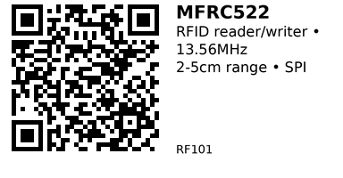

# MFRC522

An RFID reader/writer module based on the NXP MFRC522 chip. Reads and writes MIFARE Classic cards at 13.56 MHz via SPI interface. Commonly used for access control, tool tracking, and attendance systems.

**Aliases:** Also sold as "RC522" by some vendors (same module)

## Key Specifications

- **Chip:** NXP MFRC522 (13.56 MHz)
- **Operating voltage:** 3.3V (logic and power)
- **Interface:** SPI (3.3V logic)
- **Supported tags:** MIFARE Classic 1K/4K
- **Not supported:** NTAG, Ultralight, DesFire, MIFARE Plus
- **Read range:** 2–5 cm (typical with PCB antenna)
- **Module size:** ~40mm × 60mm (typical breakout)

## Pinout

| Pin | Name | Description |
|-----|------|-------------|
| 1 | SDA/SS | SPI chip select (any GPIO) |
| 2 | SCK | SPI clock |
| 3 | MOSI | SPI data out |
| 4 | MISO | SPI data in |
| 5 | IRQ | Interrupt (optional, rarely used) |
| 6 | GND | Ground |
| 7 | RST | Reset (any GPIO) |
| 8 | 3.3V | Power supply (3.3V only) |

## Wiring

### Basic Connection (ESP32)

Using ESP32 default VSPI pins:

```
RC522      ESP32
------     ------
SDA/SS --> GPIO 5 (or any free GPIO)
SCK    --> GPIO 18
MOSI   --> GPIO 23
MISO   --> GPIO 19
RST    --> GPIO 22 (or any free GPIO)
3.3V   --> 3.3V
GND    --> GND
```

**Note:** If using custom SPI pins, adjust `SPI.begin(SCK, MISO, MOSI, SS)` accordingly.

## Usage Notes

### When to Use

**Use this component when:**

- Building card-based access control (doors, lockers, drawers)
- Tool/inventory tracking with RFID tags
- Attendance/check-in systems
- Need read AND write capability (not just read-only)

**Don't use when:**

- Need longer range (use 125kHz EM4100 reader for 10-15cm, or UHF RFID for meters)
- Need NTAG215/216 support (use PN532 instead)
- Need high security (MIFARE Classic has known vulnerabilities)

### Common Issues

- **Tag type matters:** This reader ONLY works with MIFARE Classic 1K/4K. NTAG, Ultralight, DesFire will not work.
- **Default keys:** New cards ship with Key A = `FF FF FF FF FF FF`. Change keys for security.
- **Block 0 is read-only:** Contains the card UID, cannot be written. Use blocks 4–62 for user data.
- **Sector trailers:** Every 4th block (3, 7, 11, ...) stores keys and access bits. Don't write unless you know what you're doing—bad writes can permanently lock sectors.
- **Short wires:** Keep wiring under 10cm for reliable operation. USB noise can cause false reads.
- **No metal backing:** Don't mount with metal directly behind antenna (degrades range).

## Code Examples

### Read Card UID

Basic example to detect and read card UID:

```cpp
// RC522/MFRC522 Read UID Example (ESP32)
#include <SPI.h>
#include <MFRC522.h>

static const int SS_PIN  = 5;   // SDA/SS
static const int RST_PIN = 22;  // RST

MFRC522 rfid(SS_PIN, RST_PIN);

void setup() {
  Serial.begin(115200);
  SPI.begin(18, 19, 23, SS_PIN);  // SCK, MISO, MOSI, SS
  rfid.PCD_Init();
  Serial.println("Present a MIFARE Classic card...");
}

void loop() {
  // Check for new card
  if (!rfid.PICC_IsNewCardPresent() || !rfid.PICC_ReadCardSerial()) {
    delay(50);
    return;
  }

  // Print UID
  Serial.print("UID: ");
  for (byte i = 0; i < rfid.uid.size; i++) {
    if (rfid.uid.uidByte[i] < 0x10) Serial.print('0');
    Serial.print(rfid.uid.uidByte[i], HEX);
    Serial.print(i + 1 < rfid.uid.size ? ':' : '\n');
  }

  // Cleanup
  rfid.PICC_HaltA();
  rfid.PCD_StopCrypto1();
}
```

### Write Data to Card

Write 16 bytes to block 4 (first user data block):

```cpp
// RC522/MFRC522 Write Example (ESP32)
#include <SPI.h>
#include <MFRC522.h>

static const int SS_PIN  = 5;
static const int RST_PIN = 22;

MFRC522 rfid(SS_PIN, RST_PIN);
MFRC522::MIFARE_Key key;

// Data to write (exactly 16 bytes per block)
byte dataBlock[16] = {'H','e','l','l','o',' ','R','F','I','D',' ','!',0,0,0,0};

void setup() {
  Serial.begin(115200);
  SPI.begin(18, 19, 23, SS_PIN);
  rfid.PCD_Init();

  // Initialize default key (FF FF FF FF FF FF)
  for (byte i = 0; i < 6; i++) key.keyByte[i] = 0xFF;

  Serial.println("Present a card to write...");
}

void loop() {
  if (!rfid.PICC_IsNewCardPresent() || !rfid.PICC_ReadCardSerial()) {
    delay(50);
    return;
  }

  byte block = 4;  // First safe user data block

  // Authenticate with Key A
  MFRC522::StatusCode status;
  status = rfid.PCD_Authenticate(MFRC522::PICC_CMD_MF_AUTH_KEY_A, block, &key, &(rfid.uid));

  if (status != MFRC522::STATUS_OK) {
    Serial.println("Auth failed!");
    rfid.PICC_HaltA();
    rfid.PCD_StopCrypto1();
    return;
  }

  // Write 16 bytes
  status = rfid.MIFARE_Write(block, dataBlock, 16);
  if (status == MFRC522::STATUS_OK) {
    Serial.println("Write OK!");
  } else {
    Serial.println("Write failed!");
  }

  rfid.PICC_HaltA();
  rfid.PCD_StopCrypto1();
  delay(2000);  // Prevent multiple writes
}
```

**Safe blocks to use:**

- **1K cards:** Blocks 4–6, 8–10, 12–14, ... (skip every 4th block = sector trailer)
- **Avoid block 0:** Contains UID (read-only)
- **Avoid sector trailers:** Blocks 3, 7, 11, 15, ... (contain keys/access bits)

## Links

- [Datasheet (MFRC522)](https://www.nxp.com/docs/en/data-sheet/MFRC522.pdf)
- [Purchase: AliExpress](https://www.aliexpress.com/item/1005010384904465.html)
- [Library: MFRC522 (Miguel Balboa)](https://github.com/miguelbalboa/rfid)
- [Tutorial: ESP32 + RC522 (Random Nerd Tutorials)](https://randomnerdtutorials.com/esp32-mfrc522-rfid-reader-arduino/)

---


