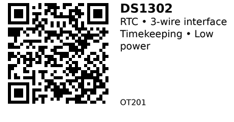

# DS1302 Real-Time Clock Module - OT201

A low-power real-time clock (RTC) chip with 31 bytes of static RAM and battery backup capability. Keeps track of seconds, minutes, hours, day, date, month, and year with automatic leap year compensation. Uses a simple 3-wire serial interface (RST, I/O, SCLK) instead of I2C, making it easy to interface with microcontrollers. Draws only 1 µW in battery backup mode, allowing CR2032 coin cell to last years.

## Key Specifications

- **Supply Voltage**: 2.0V - 5.5V (dual supply: VCC1 backup, VCC2 primary)
- **Interface**: 3-wire serial (RST/CE, I/O, SCLK)
- **Timekeeping**: Seconds, minutes, hours, day, date, month, year
- **Clock Format**: 12-hour (with AM/PM) or 24-hour
- **RAM**: 31 bytes of static RAM
- **Crystal**: 32.768 kHz (external, not included in all modules)
- **Backup Current**: <1 µW (data retention only)
- **Operating Current**: ~300 µA @ 2V, ~1 mA @ 5V
- **Package**: 8-pin DIP or module with coin cell holder

## Pinout

| Pin | Name | Description |
|-----|------|-------------|
| 1 | VCC2 | Primary power supply (2.0-5.5V) |
| 2 | X1 | Crystal oscillator input (32.768 kHz) |
| 3 | X2 | Crystal oscillator output (32.768 kHz) |
| 4 | GND | Ground |
| 5 | RST/CE | Reset/Chip Enable (active HIGH for data transfer) |
| 6 | I/O | Bidirectional data pin |
| 7 | SCLK | Serial clock input |
| 8 | VCC1 | Backup power supply (connect to battery, e.g., CR2032) |

**Notes:**

- VCC1 and VCC2: Chip automatically switches to higher voltage source
- Modules often have VCC1 connected to coin cell holder, VCC2 to main power
- RST must be HIGH during data transfer, LOW otherwise
- 32.768 kHz crystal required (some modules include it)

## Wiring

### Basic Connection (ESP32)

```
DS1302 Module    ESP32
--------------   ------
VCC (VCC2)   --> 3.3V (or 5V)
GND          --> GND
RST/CE       --> GPIO 5 (or any GPIO)
DAT (I/O)    --> GPIO 18 (or any GPIO)
CLK (SCLK)   --> GPIO 19 (or any GPIO)
BAT (VCC1)   --> CR2032 coin cell (via onboard holder)
```

**No pull-up resistors needed** (unlike I2C). The 3-wire interface is simple digital I/O.

## Usage Notes

### When to Use

**Use this component when:**

- Need basic timekeeping with battery backup
- Want simple 3-wire interface (easier than I2C for some microcontrollers)
- Low power consumption critical (1 µW backup mode)
- Need small amount of non-volatile RAM (31 bytes)

**Don't use when:**

- Need I2C interface (use OT202 DS1307 instead)
- Need more NVRAM (DS1307 has 56 bytes)
- Need square wave output (DS1307 has programmable SQW pin)
- Sharing bus with multiple devices (3-wire requires dedicated pins)

### Common Issues

- **Time resets to 2000:** Battery dead or not connected. Replace CR2032 coin cell.
- **Clock stops:** Check that 32.768 kHz crystal is properly connected (some modules require external crystal).
- **Erratic readings:** Ensure RST is LOW when not communicating (some libraries don't handle this correctly).
- **Wrong time:** DS1302 doesn't have built-in temperature compensation—accuracy drifts ±2 ppm/°C (±5 min/year typical).

## Code Examples

### Arduino/ESP32

```cpp
#include <ThreeWire.h>
#include <RtcDS1302.h>

// Define pins (RST, DAT, CLK)
ThreeWire myWire(18, 5, 19);  // DAT/IO, RST/CE, CLK/SCLK
RtcDS1302<ThreeWire> Rtc(myWire);

void setup() {
  Serial.begin(115200);
  Rtc.Begin();

  // Set time (only needed once)
  // RtcDateTime compiled = RtcDateTime(__DATE__, __TIME__);
  // Rtc.SetDateTime(compiled);
}

void loop() {
  RtcDateTime now = Rtc.GetDateTime();

  Serial.printf("%04d/%02d/%02d %02d:%02d:%02d\n",
    now.Year(), now.Month(), now.Day(),
    now.Hour(), now.Minute(), now.Second());

  delay(1000);
}
```

**Libraries:**

- [Rtc by Makuna](https://github.com/Makuna/Rtc) - Supports DS1302, DS1307, DS3231

## DS1302 vs DS1307

| Feature | DS1302 (OT201) | DS1307 (OT202) |
|---------|----------------|----------------|
| Interface | 3-wire serial | I2C |
| Voltage | 2.0-5.5V | 4.5-5.5V (3.3V with reduced specs) |
| RAM | 31 bytes | 56 bytes NVRAM |
| SQW Output | No | Yes (1Hz, 4kHz, 8kHz, 32kHz) |
| Backup Current | <1 µW | <500 nA |
| Bus Sharing | No (dedicated pins) | Yes (I2C multi-device) |

**Choose DS1302 (OT201)** if you want simple 3-wire interface and wide voltage range (2.0-5.5V).
**Choose DS1307 (OT202)** if you need I2C compatibility and square wave output.

## Links

- [Datasheet: Analog Devices DS1302](https://www.analog.com/media/en/technical-documentation/data-sheets/ds1302.pdf)
- [Purchase: DS1302 RTC Module (AliExpress)](https://www.aliexpress.com/w/wholesale-ds1302-rtc-module.html)
- [Tutorial: DS1302 with ESP32 (ESPBoards)](https://www.espboards.dev/sensors/ds1302/)
- [Library: Rtc by Makuna](https://github.com/Makuna/Rtc)

---


