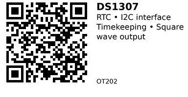

# DS1307 Real-Time Clock Module - OT202

A low-power I2C real-time clock (RTC) with 56 bytes of battery-backed NVRAM and programmable square wave output. Keeps track of seconds, minutes, hours, day, date, month, and year with automatic leap year compensation. Uses standard I2C interface (address 0x68) for easy integration with other I2C devices. Includes square wave output (SQW) at 1Hz, 4kHz, 8kHz, or 32kHz—useful for timer interrupts or clock signals.

## Key Specifications

- **Supply Voltage**: 4.5V - 5.5V (3.3V operation possible with reduced specs)
- **Interface**: I2C (address 0x68, 100 kHz standard mode only)
- **Timekeeping**: Seconds, minutes, hours, day, date, month, year
- **Clock Format**: 12-hour (with AM/PM) or 24-hour
- **NVRAM**: 56 bytes of battery-backed RAM
- **Square Wave Output**: 1Hz, 4kHz, 8kHz, or 32kHz (programmable on SQW pin)
- **Crystal**: 32.768 kHz (external, included on most modules)
- **Backup Current**: <500 nA (data retention only)
- **Operating Current**: ~1.5 mA @ 5V
- **Package**: 8-pin DIP or module with coin cell holder

## Pinout

| Pin | Name | Description |
|-----|------|-------------|
| 1 | X1 | Crystal oscillator input (32.768 kHz) |
| 2 | X2 | Crystal oscillator output (32.768 kHz) |
| 3 | VBAT | Battery backup power (2.0-3.5V, e.g., CR2032) |
| 4 | GND | Ground |
| 5 | SDA | I2C data line (open-drain, requires pull-up) |
| 6 | SCL | I2C clock line (requires pull-up) |
| 7 | SQW/OUT | Square wave output (programmable frequency) |
| 8 | VCC | Primary power supply (4.5-5.5V) |

**Notes:**

- I2C address: 0x68 (fixed, not configurable)
- SDA/SCL require 4.7kΩ pull-up resistors (usually included on modules)
- VBAT: Chip automatically switches to battery when VCC drops below ~3V
- SQW output can drive 15pF load, useful for interrupts or external clock

## Wiring

### Basic Connection (ESP32)

```
DS1307 Module    ESP32
--------------   ------
VCC          --> 5V (or 3.3V with caution*)
GND          --> GND
SDA          --> GPIO 21 (I2C SDA)
SCL          --> GPIO 22 (I2C SCL)
SQW          --> GPIO 23 (optional, for interrupts)
BAT (VBAT)   --> CR2032 coin cell (via onboard holder)
```

**\*3.3V operation:** DS1307 is rated for 4.5-5.5V, but many modules work at 3.3V with slightly reduced timekeeping accuracy. Use 5V if available on ESP32 (most dev boards have a 5V pin).

**Pull-up resistors:** Most modules include 4.7kΩ pull-ups on SDA/SCL. If missing, add external pull-ups to VCC.

## Usage Notes

### When to Use

**Use this component when:**

- Need I2C interface (share bus with other I2C devices)
- Want square wave output for timer interrupts (1Hz tick, etc.)
- Need more battery-backed RAM (56 bytes vs 31 bytes in DS1302)
- Standard I2C ecosystem compatibility

**Don't use when:**

- Need ultra-low power (DS1302 draws <1 µW vs <500 nA for DS1307)
- Need 2.0V operation (DS1307 requires 4.5-5.5V nominally)
- Prefer simpler 3-wire interface (use OT201 DS1302 instead)
- Need high-precision RTC (DS3231 has ±2 ppm vs ±2 ppm/°C for DS1307)

### Common Issues

- **Time resets to 2000:** Battery dead or not connected. Replace CR2032 coin cell.
- **I2C communication fails:** Check pull-up resistors on SDA/SCL (4.7kΩ to VCC). Verify I2C address is 0x68.
- **Clock slow/fast:** DS1307 has no temperature compensation—accuracy drifts ±2 ppm/°C. Consider DS3231 for ±2 ppm over full temp range.
- **3.3V compatibility:** While many modules work at 3.3V, official spec is 4.5-5.5V. Use 5V if possible for best reliability.

## Code Examples

### Arduino/ESP32

```cpp
#include <Wire.h>
#include <RTClib.h>

RTC_DS1307 rtc;

void setup() {
  Serial.begin(115200);

  if (!rtc.begin()) {
    Serial.println("Couldn't find RTC!");
    while (1);
  }

  // Set time (only needed once)
  // rtc.adjust(DateTime(F(__DATE__), F(__TIME__)));

  // Enable 1Hz square wave output on SQW pin
  rtc.writeSqwPinMode(DS1307_SquareWave1HZ);
}

void loop() {
  DateTime now = rtc.now();

  Serial.printf("%04d/%02d/%02d %02d:%02d:%02d\n",
    now.year(), now.month(), now.day(),
    now.hour(), now.minute(), now.second());

  delay(1000);
}
```

### Reading/Writing NVRAM

```cpp
// Write data to NVRAM (address 0-55)
uint8_t data[] = {0x42, 0xAA, 0xFF};
rtc.writeRAM(0, data, sizeof(data));

// Read data from NVRAM
uint8_t buffer[3];
rtc.readRAM(0, buffer, sizeof(buffer));
```

**Libraries:**

- [RTClib by Adafruit](https://github.com/adafruit/RTClib) - Supports DS1307, DS3231, PCF8523
- [Rtc by Makuna](https://github.com/Makuna/Rtc) - Supports DS1302, DS1307, DS3231

## DS1307 vs DS1302

| Feature | DS1307 (OT202) | DS1302 (OT201) |
|---------|----------------|----------------|
| Interface | I2C (address 0x68) | 3-wire serial |
| Voltage | 4.5-5.5V nominal | 2.0-5.5V |
| RAM | 56 bytes NVRAM | 31 bytes |
| SQW Output | Yes (1Hz, 4kHz, 8kHz, 32kHz) | No |
| Backup Current | <500 nA | <1 µW |
| Bus Sharing | Yes (I2C multi-device) | No (dedicated pins) |

**Choose DS1307 (OT202)** if you need I2C compatibility, square wave output, or more NVRAM.
**Choose DS1302 (OT201)** if you want wide voltage range (2.0-5.5V) and simpler 3-wire interface.

## Links

- [Datasheet: Analog Devices DS1307](https://www.analog.com/media/en/technical-documentation/data-sheets/ds1307.pdf)
- [Purchase: DS1307 RTC Module (AliExpress)](https://www.aliexpress.com/w/wholesale-ds1307-rtc-module.html)
- [Tutorial: DS1307 with Arduino (Components101)](https://components101.com/ics/ds1307-i2c-real-time-clock-rtc)
- [Library: RTClib by Adafruit](https://github.com/adafruit/RTClib)

---


