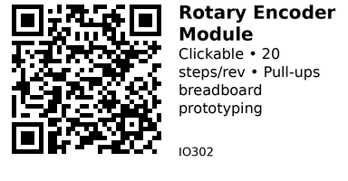

# Rotary Encoder Module (Starter Kit) - IO302

Simple rotary encoder breakout module commonly found in Arduino/ESP32 starter kits. Features built-in pull-up resistors and standard 3-pin output (CLK/DT/SW) for easy breadboard integration.

## Key Specifications

| Parameter | Value |
|-----------|-------|
| **Encoder type** | Mechanical incremental |
| **Steps per revolution** | 20 (typical) |
| **Output type** | Quadrature (CLK/DT) + Switch |
| **Supply voltage** | 3.3V - 5V |
| **Pull-ups** | Built-in (10kΩ typical) |
| **Rotation** | 360° continuous |
| **Mounting** | Breadboard-friendly pins |

## Pinout

```
Rotary Encoder Module
      ___
     |   |
     | ⟳ |
     |___|
     | | | | |
     C D S V G
     L T W C N
     K     C D

CLK = Clock (Channel A)
DT  = Data (Channel B)
SW  = Switch (button press, active LOW)
VCC = Power (3.3V or 5V)
GND = Ground
```

**Some modules use different pinout:**
```
+ S CLK DT
(VCC, SW, CLK, DT - no GND pin, shares common ground)
```

## Typical Wiring (ESP32)

```
ESP32           Encoder Module
-----           --------------
3.3V   -------> VCC
GND    -------> GND
GPIO25 -------> CLK
GPIO26 -------> DT
GPIO27 -------> SW (optional)
```

## Example Code (ESP32)

```cpp
// ESP32 + Rotary Encoder Module
#define CLK_PIN 25
#define DT_PIN  26
#define SW_PIN  27

volatile int position = 0;
int lastClk = HIGH;

void IRAM_ATTR readEncoder() {
  int clk = digitalRead(CLK_PIN);
  int dt = digitalRead(DT_PIN);

  if (clk != lastClk && clk == LOW) {
    if (dt == HIGH) {
      position++;
    } else {
      position--;
    }
  }
  lastClk = clk;
}

void setup() {
  Serial.begin(115200);

  pinMode(CLK_PIN, INPUT);
  pinMode(DT_PIN, INPUT);
  pinMode(SW_PIN, INPUT_PULLUP);

  attachInterrupt(digitalPinToInterrupt(CLK_PIN), readEncoder, CHANGE);
}

void loop() {
  static int lastPos = 0;

  if (position != lastPos) {
    Serial.printf("Position: %d\n", position);
    lastPos = position;
  }

  if (digitalRead(SW_PIN) == LOW) {
    Serial.println("Button pressed!");
    delay(200);  // Simple debounce
  }

  delay(10);
}
```

## Key Features

**Built-in pull-ups:**
- No external resistors needed
- Direct GPIO connection
- Simplified wiring

**Breadboard-friendly:**
- Standard 0.1" (2.54mm) pin spacing
- Easy prototyping
- No soldering required

**Compact size:**
- Small PCB footprint
- Fits in tight spaces
- Lightweight

## Gotchas

1. **Pinout variations:** Different manufacturers use different pin orders - always check markings
2. **No VCC needed (sometimes):** Some modules work without VCC if using internal pull-ups
3. **Debouncing required:** Mechanical contacts bounce - add software debounce
4. **Direction inconsistency:** CW/CCW direction may vary by module - test first

## Comparison with KY-040

| Feature | IO302 (Generic Module) | IO301 (KY-040) |
|---------|----------------------|----------------|
| **Pinout** | Varies by manufacturer | Standardized |
| **Size** | Smaller | Larger PCB |
| **Quality** | Variable | More consistent |
| **Price** | $0.30-0.50 | $0.50-1.00 |
| **Features** | Basic | Better build quality |

**When to use IO302:**
- Breadboard prototyping
- Starter kit projects
- Budget constraints
- Space-limited designs

**When to use IO301 (KY-040):**
- Panel mounting needed
- Better tactile feel desired
- Consistent quality required

## Applications

**Learning projects:** Perfect for Arduino/ESP32 tutorials.

**Breadboard prototypes:** Easy testing without soldering.

**Menu navigation:** Simple UI controls for displays.

**Volume control:** Audio projects, amplifiers.

## Troubleshooting

**Doesn't respond:**
- Check pinout (CLK/DT may be swapped)
- Verify power connection
- Test with known-good code

**Counts wrong direction:**
- Swap CLK and DT pins
- Or invert logic in code

**Erratic counting:**
- Add debouncing
- Check for loose connections
- Slow down rotation for testing

## Links

- **AliExpress**: Search "rotary encoder module arduino" (~$0.30-0.50)

---


