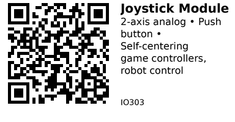

# Analog 2-Axis Joystick Module - IO303

Analog joystick module with X/Y axis potentiometers and center push button. Self-centering spring returns stick to neutral position. Perfect for game controllers, robot steering, and camera pan/tilt control.

## Key Specifications

| Parameter | Value |
|-----------|-------|
| **Axes** | 2 (X and Y) |
| **Output type** | Analog voltage (0-3.3V) |
| **Center voltage** | ~1.65V (mid-point) |
| **Range** | Full 360° circular motion |
| **Button** | Push-to-click (normally open) |
| **Supply voltage** | 3.3V - 5V |
| **Resistance** | 10kΩ potentiometers (typical) |
| **Self-centering** | Spring-loaded return to center |

## How It Works

**Dual potentiometer design:**
- X-axis: Horizontal movement (left/right)
- Y-axis: Vertical movement (up/down)
- Each axis is a voltage divider
- Center position outputs ~50% of VCC
- Moving stick changes resistance → changes voltage

**Spring return:**
- Integrated spring pulls stick to center
- Center position when released
- Consistent neutral point

**Push button:**
- Press down on joystick to activate
- Separate switch independent of X/Y
- Active LOW (pressed = LOW)

## Pinout

```
Joystick Module
     ___
    |   |
    | ⊕ | Joystick
    |___|
    | | | | |
    G V V V S
    N C R R W
    D C X Y

GND = Ground
VCC = Power (3.3V or 5V)
VRX = X-axis output (analog voltage)
VRY = Y-axis output (analog voltage)
SW  = Switch (button press, active LOW)
```

**Some modules use different pinout:**
```
+5V GND VRX VRY SW
```

## Typical Wiring (ESP32)

```
ESP32           Joystick
-----           --------
3.3V   -------> VCC
GND    -------> GND
GPIO34 -------> VRX (X-axis, ADC1)
GPIO35 -------> VRY (Y-axis, ADC1)
GPIO25 -------> SW  (Button, optional)
```

**Important:** Use ADC1 pins on ESP32 (GPIO32-39), NOT ADC2 (conflicts with WiFi).

## Example Code (ESP32)

```cpp
// ESP32 + Joystick Module
#define VRX_PIN 34   // X-axis
#define VRY_PIN 35   // Y-axis
#define SW_PIN  25   // Button

void setup() {
  Serial.begin(115200);
  pinMode(SW_PIN, INPUT_PULLUP);
  analogSetAttenuation(ADC_11db);  // Full 0-3.3V range
}

void loop() {
  // Read analog values (0-4095 on ESP32)
  int xValue = analogRead(VRX_PIN);
  int yValue = analogRead(VRY_PIN);
  bool buttonPressed = (digitalRead(SW_PIN) == LOW);

  // Display raw values
  Serial.printf("X: %4d | Y: %4d | Button: %s\n",
                xValue, yValue, buttonPressed ? "PRESSED" : "Released");

  delay(100);
}
```

## Calibration

**Step 1 - Find center values:**
```cpp
void calibrate() {
  Serial.println("Leave joystick centered...");
  delay(2000);

  int centerX = analogRead(VRX_PIN);
  int centerY = analogRead(VRY_PIN);

  Serial.printf("Center: X=%d, Y=%d\n", centerX, centerY);
  // Typical: X=2048, Y=2048 (mid-point of 0-4095)
}
```

**Step 2 - Find min/max values:**
```cpp
void calibrate() {
  Serial.println("Move joystick in full circle...");

  int minX = 4095, maxX = 0;
  int minY = 4095, maxY = 0;

  for (int i = 0; i < 100; i++) {
    int x = analogRead(VRX_PIN);
    int y = analogRead(VRY_PIN);

    minX = min(minX, x);
    maxX = max(maxX, x);
    minY = min(minY, y);
    maxY = max(maxY, y);

    delay(50);
  }

  Serial.printf("X range: %d to %d\n", minX, maxX);
  Serial.printf("Y range: %d to %d\n", minY, maxY);
}
```

## Mapped Output (-100 to +100)

```cpp
int mapJoystick(int value, int center, int min, int max) {
  if (value < center) {
    return map(value, min, center, -100, 0);
  } else {
    return map(value, center, max, 0, 100);
  }
}

void loop() {
  int xRaw = analogRead(VRX_PIN);
  int yRaw = analogRead(VRY_PIN);

  // Map to -100 (left/down) to +100 (right/up)
  int xPercent = mapJoystick(xRaw, 2048, 0, 4095);
  int yPercent = mapJoystick(yRaw, 2048, 0, 4095);

  Serial.printf("X: %+4d%% | Y: %+4d%%\n", xPercent, yPercent);
  delay(100);
}
```

## Dead Zone (Eliminate Jitter)

Center position isn't perfectly stable. Add dead zone to ignore small movements:

```cpp
int applyDeadZone(int value, int threshold) {
  if (abs(value) < threshold) {
    return 0;  // In dead zone
  }
  return value;
}

void loop() {
  int xPercent = mapJoystick(analogRead(VRX_PIN), 2048, 0, 4095);
  int yPercent = mapJoystick(analogRead(VRY_PIN), 2048, 0, 4095);

  // Apply 10% dead zone
  xPercent = applyDeadZone(xPercent, 10);
  yPercent = applyDeadZone(yPercent, 10);

  Serial.printf("X: %+4d%% | Y: %+4d%%\n", xPercent, yPercent);
  delay(100);
}
```

## Robot Control Example

```cpp
void loop() {
  int xRaw = analogRead(VRX_PIN);
  int yRaw = analogRead(VRY_PIN);

  // Map to motor speed (-255 to +255)
  int forward = map(yRaw, 0, 4095, -255, 255);
  int turn = map(xRaw, 0, 4095, -255, 255);

  // Differential drive calculation
  int leftMotor = constrain(forward + turn, -255, 255);
  int rightMotor = constrain(forward - turn, -255, 255);

  Serial.printf("Left: %+4d | Right: %+4d\n", leftMotor, rightMotor);

  // Send to motor driver (e.g., L298N, TB6612)
  // setMotorSpeed(LEFT_MOTOR, leftMotor);
  // setMotorSpeed(RIGHT_MOTOR, rightMotor);

  delay(50);
}
```

## Game Controller Example

```cpp
void loop() {
  int xPercent = mapJoystick(analogRead(VRX_PIN), 2048, 0, 4095);
  int yPercent = mapJoystick(analogRead(VRY_PIN), 2048, 0, 4095);
  bool fire = (digitalRead(SW_PIN) == LOW);

  // Apply dead zone
  xPercent = applyDeadZone(xPercent, 15);
  yPercent = applyDeadZone(yPercent, 15);

  // Game logic
  if (abs(xPercent) > abs(yPercent)) {
    if (xPercent > 50) Serial.println("Move RIGHT");
    else if (xPercent < -50) Serial.println("Move LEFT");
  } else {
    if (yPercent > 50) Serial.println("Move UP");
    else if (yPercent < -50) Serial.println("Move DOWN");
  }

  if (fire) Serial.println("FIRE!");

  delay(100);
}
```

## Key Features

**Analog 2-axis:**
- Proportional control (not just on/off)
- Smooth gradual movement
- Full 360° range of motion

**Self-centering:**
- Returns to neutral automatically
- Consistent zero position
- No manual zeroing needed

**Push button:**
- Additional input option
- Perfect for "fire" or "select"
- Independent of X/Y movement

## Gotchas

1. **Center drift:** Center position varies (not exactly 512/2048) - calibrate!
2. **ADC noise:** Analog readings jitter - use dead zone and averaging
3. **Button affects position:** Pressing button slightly changes X/Y - ignore if using both
4. **ADC2 WiFi conflict (ESP32):** Use ADC1 pins (GPIO32-39) only
5. **Voltage dependent:** Output range depends on VCC (use 3.3V for ESP32 ADC)
6. **Not precision control:** Potentiometers wear out, readings drift over time

## Applications

**Game controllers:** Retro gaming, arcade controls, flight simulators.

**Robot control:** Differential drive robots, RC cars, tank steering.

**Camera gimbal:** Pan/tilt control for camera mounts.

**Drone controller:** Manual flight control for DIY drones.

**Wheelchair joystick:** Mobility device control interfaces.

**RC transmitter:** DIY radio control transmitter.

## Troubleshooting

**Readings stuck at 0 or max:**
- Check wiring (VRX/VRY swapped?)
- Verify VCC connected
- Joystick may be broken

**Center position drifts:**
- Normal - use dead zone
- Potentiometers wearing out (replace module)
- Temperature affects readings

**Button doesn't work:**
- Check pull-up resistor enabled
- Active LOW logic (pressed = LOW)
- Test with multimeter (continuity mode)

**Jittery readings:**
- Normal ADC noise
- Add averaging (read 10 samples, take average)
- Increase dead zone threshold

## Links

- **AliExpress**: Search "PS2 joystick module arduino" (~$0.50-1)

---


