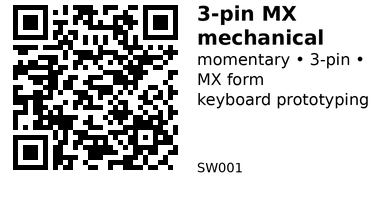

# 3‑pin MX mechanical switch (10pcs) - SW001

Mechanical keyboard switch (MX-compatible, Outemu style). Momentary, normally-open switch used for key matrices and general digital inputs. Fits MX hot‑swap sockets and through‑hole 3‑pin PCBs.

## Links

- **Where to buy:** [AliExpress](https://www.aliexpress.com/item/1005004341695529.html)

## Specifications

- Form factor: MX‑compatible 3‑pin (mechanical switch, no LED included)

- Action: Momentary (tactile/linear varies by color; NO contact)

- Colors: Blue/Red/Brown/Black (actuation feel varies)

## Pinout & Addresses (common breakout labels)

- 3‑pin: 2 switch terminals + locating pin; use the two metal pins as switch contacts (no polarity).

## Wiring

- Use as a simple digital input. Connect one side to an ESP32 GPIO (with internal pull‑up enabled) and the other side to GND.

- For matrix keyboards, use diode‑isolated scanning; for single keys, a direct pull‑up/pull‑down is fine.

---

*QR for printing will appear here after you run the script:*

