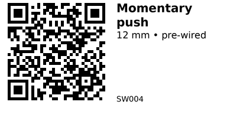

# Momentary push (pre‑wired) - SW004

Round 12 mm panel‑mount momentary pushbutton (PBS‑33B style) with pre‑soldered leads for quick install. Suitable for user input, reset, or trigger lines.

## Links

- **Where to buy:** [AliExpress](https://www.aliexpress.com/item/1005005789195514.html)

## Specifications

- Mount hole: 12 mm

- Action: Momentary (Push = ON, Release = OFF), SPST NO

- Rating: 3A @ 125VAC (also listed 1A @ 250VAC) — for logic use only a few mA

- Leads: pre‑wired (approx. 20 AWG)

## Pinout & Addresses (common breakout labels)

- 2 leads: simple SPST normally open contacts (no polarity).

## Wiring

- Connect one lead to ESP32 GPIO (INPUT_PULLUP) and the other to GND.

- If used on higher voltage, keep logic isolated; use a transistor or optocoupler if needed.

---

*QR for printing will appear here after you run the script:*

