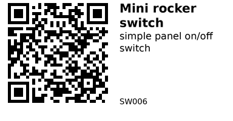

# Mini rocker switch (pre-wired) - SW006

Small panel-mount ON/OFF rocker switch with two pre-wired leads.
Useful any time you need a simple latching on/off control for a DC load (like a 12 V fan, LED strip, pump, etc.) or as a low-voltage input to an ESP32.
The switch body is mains-rated (up to 10 A @ 125 VAC / 6 A @ 250 VAC), but you should only use it with mains if everything is wired and enclosed safely. For ESP32 projects, it’s usually used at low voltage (3.3–12 V).

## Links

- **Where to buy:** [AliExpress](https://www.aliexpress.com/item/1005006117766211.html)
- **Datasheet (generic KCD1 series, example):** [PDF](https://www.ncr.hk/uploads/Switches/Rocker_Switch/KCD1-101F.pdf)

## Specifications

(Values based on the AliExpress listing and a generic KCD1 mini rocker switch datasheet; expect small variations between manufacturers.)

- Type: Mini rocker switch, pre-wired
- Function: SPST, latching ON/OFF (2 positions)
- Terminals: 2-pin, factory pre-wired leads
- Rated voltage/current (AC):
    - 10 A @ 125 VAC
    - 6 A @ 250 VAC
- Suitable for: 12 V DC loads (well inside the AC ratings)
- Mechanical life: approx. 20,000–40,000 operations (typical)
- Operating temperature: -25 °C to +85 °C
- Insulation resistance: ≥ 100 MΩ (typical)
- Contact resistance: ≤ 0.03 Ω (typical)
- Withstand / dielectric voltage: ≥ 1500 VAC (for 1 minute, typical)
- Mounting: Snap-in panel mount
- Panel hole: ~20 mm round (check your specific part before cutting final panels)
- Body material: Plastic (nylon) with metal contacts
- Pack size: 6 switches

## Pinout & Addresses (common breakout labels)

This is just a mechanical switch, so there are no digital addresses or protocols.

Each switch has **two pre-wired leads**:

- **Lead 1** – one side of the contact
- **Lead 2** – the other side of the contact

When the rocker is **ON**, the two leads are connected (closed).  
When the rocker is **OFF**, the two leads are disconnected (open).  

Polarity does **not** matter for the switch itself. You can treat either lead as “input” or “output” for DC, and either side as line/load for AC (subject to normal mains safety practices).

## Wiring

### 1. As a simple 12 V load switch (no ESP32 involvement)

Use this when you just want a manual on/off switch in your panel.

- Connect **lead 1** to the positive supply (e.g. +12 V from your power supply).
- Connect **lead 2** to the positive terminal of your load (fan, LED strip, etc.).
- Connect the other terminal of the load back to the supply ground (0 V).

When the switch is ON, the load receives power. When it is OFF, the load is disconnected.

> ⚠️ **For mains AC loads (125/250 VAC)**: only do this in a fully enclosed, properly rated mains project, with adequate creepage distances, strain relief and cable management. Do **not** mix mains and ESP32 low-voltage wiring in the same open box.

### 2. As an input to an ESP32 (low voltage only)

To use the switch as a digital input (e.g. “user pressed power”, “mode select”, etc.), use it **only at low voltage** (3.3 V). The switch is just a contact, so using it at low voltage is completely fine and well below its rating.

Typical wiring with internal pull-up on the ESP32:

- Choose a GPIO pin, e.g. **GPIO 25**.
- Connect **lead 1** of the switch to **GND**.
- Connect **lead 2** of the switch to **GPIO 25**.
- In code, enable the internal pull-up resistor on GPIO 25.

When the switch is ON, GPIO 25 will be pulled to GND (logic LOW).  
When the switch is OFF, GPIO 25 will be pulled HIGH by the internal pull-up.

## Gotchas

- **Do not put mains and ESP32 on the same contacts at the same time.**  
  Either use the switch purely for low-voltage logic / DC loads, or purely for mains — never both on the same physical switch.
- **No debouncing built-in.**  
  It’s just mechanical contacts, so you should debounce in software if you read it on a GPIO.
- **Panel hole size can vary between manufacturers.**  
  Check your particular batch before cutting a final front panel; most KCD1 round versions are around 20 mm.
- **Pre-wired leads may not be silicone.**  
  Don’t let them sit against hot components or heatsinks unless you know their temperature rating.

## How to use

### Example: Read the switch with an ESP32 (Arduino framework)

This example uses the switch as a simple ON/OFF input on GPIO 25 with the internal pull-up enabled.

```cpp
// Mini rocker switch (pre-wired) example
// Switch wired between GPIO 25 and GND
// Board: ESP32 (Arduino core)

const int SWITCH_PIN = 25;

void setup() {
  Serial.begin(115200);

  // Use the internal pull-up so the pin is HIGH when the switch is open
  pinMode(SWITCH_PIN, INPUT_PULLUP);
}

void loop() {
  // LOW when switch is ON (closed to GND), HIGH when OFF (open)
  bool switchOn = (digitalRead(SWITCH_PIN) == LOW);

  if (switchOn) {
    Serial.println("Switch: ON");
  } else {
    Serial.println("Switch: OFF");
  }

  delay(200);
}
```

This is enough for most “panel button / power toggle” style use cases.  
If you see noisy readings when flipping the switch, you can:

- Add a small RC filter (e.g. 0.1 µF capacitor from pin to GND + 10 kΩ series resistor), **or**
- Add a simple software debounce (ignore changes that revert within 20–50 ms).

---

*QR for printing will appear here after you run the script:*


