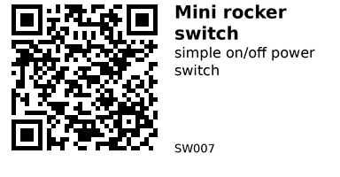

# Mini rocker switch (SPST) - SW007

Small panel-mount SPST (single-pole, single-throw) rocker switch.  
Useful anywhere you need a simple on/off control: power switches on small projects, selecting operating modes, or providing a physical kill switch for low-voltage circuits.

It is rated for up to 250 VAC 3 A / 125 VAC 6 A, but for hobby electronics it’s typically used at low DC voltages (3.3–24 V) for extra safety.

## Links

- **Where to buy:** [AliExpress](https://www.aliexpress.com/item/1005007713334301.html)
- **Datasheet:** N/A (generic part, seller does not provide a datasheet)
- **Tutorial:** N/A (standard mechanical switch)

## Specifications

From the seller title and typical mini rocker switches of this type:

- Type: SPST (single-pole, single-throw), ON–OFF
- Pins: 2
- Actuator: Rocker, black housing with red rocker
- Panel style: Snap-in, rectangular
- Switch rating (from listing title):
  - 250 VAC @ 3 A
  - 125 VAC @ 6 A
- Approximate body size: 10 × 15 mm rocker
- Mounting: Panel cut-out slightly smaller than rocker body, snap-in clips

*Note:* Exact mechanical dimensions vary slightly between manufacturers. Check the product page drawings if you need tight mechanical tolerances.

## Pinout & Contacts

This is a simple 2-pin SPST switch:

- **Pin 1:** One side of the switch (“common”).
- **Pin 2:** Other side of the switch (“switched”).

When the rocker is in the **ON** position, Pin 1 and Pin 2 are connected.  
When the rocker is **OFF**, Pin 1 and Pin 2 are open (not connected).

There is no polarity and no “address” – it’s purely mechanical.

## Wiring

### 1. As a low-voltage power switch

To use it as an on/off switch for a small DC load (e.g. a sensor or LED strip):

- Cut the **positive** wire of your supply.
- Connect the supply side of the positive wire to **Pin 1**.
- Connect the load side of the positive wire to **Pin 2**.
- Keep ground (GND) continuous – do **not** switch the ground line in most cases.

This is fine for low-voltage DC (e.g. 5–24 V) within the current rating.

### 2. As an input to an ESP32

You can also use it as a simple on/off input:

- Connect **Pin 1** to an ESP32 GPIO (e.g. `GPIO 15`).
- Connect **Pin 2** to **GND**.
- Enable the internal pull-up on the ESP32 pin.

Logic:

- Switch **OFF** → GPIO reads **HIGH** (pulled up).
- Switch **ON**  → GPIO reads **LOW** (connected to GND).

This is safer than trying to switch mains or high voltage directly from the ESP32.  
If you want to control mains, you should use proper relay / SSR modules with isolation.

## Gotchas

- **Contact bounce:** As with all mechanical switches, expect bouncing. Debounce in software or hardware if you need clean transitions.
- **Mains safety:** Even though it is rated for 250 VAC, mains wiring has strict safety rules. For hobby projects, prefer using it for low-voltage DC unless you are confident with mains wiring and follow local regulations.
- **Panel cut-out:** The body is ~10 × 15 mm, but the **cut-out** must match the snap-in design. Check your actual part and prototype the hole before committing to an enclosure design.
- **Current rating at DC:** The specified 3 A / 6 A ratings are for AC. At DC, safe current may be lower; keep some margin if switching higher DC currents.

## How to use

Example: read the switch state with an ESP32 and control an LED on another pin.

```cpp
// Simple ESP32 example for a 2-pin SPST rocker switch

const int SWITCH_PIN = 15;  // connected to one pin of the switch
const int LED_PIN    = 2;   // on-board LED on many ESP32 dev boards

void setup() {
  pinMode(SWITCH_PIN, INPUT_PULLUP); // internal pull-up
  pinMode(LED_PIN, OUTPUT);
}

void loop() {
  // LOW when switch is ON (connected to GND)
  bool switchOn = (digitalRead(SWITCH_PIN) == LOW);

  digitalWrite(LED_PIN, switchOn ? HIGH : LOW);

  delay(10); // basic debounce / polling delay
}
```

No external libraries are required – this uses only the standard Arduino core for ESP32.

---

*QR for printing will appear here after you run the script:*


