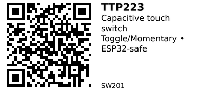

# TTP223

A tiny one-key capacitive touch switch module based on the TTP223 IC. Acts like a digital push-button: when you touch the pad it toggles or holds the output depending on solder-pad settings. Ideal as a human-touch input for ESP32 projects (UI buttons, lamps, mode selectors).

## Key Specifications

- **Module size:** 15 mm × 11 mm
- **Supply voltage (VCC):** 2.5–5.5 V
- **Output:** digital TTL (follows VCC), active HIGH or LOW per configuration
- **Modes (A/B solder pads):**
    - `A=0, B=0` → **momentary**, output HIGH while touched
    - `A=1, B=0` → **toggle (self-latch)**, output HIGH toggles on each touch
    - `A=0, B=1` → **momentary**, output LOW while touched
    - `A=1, B=1` → **toggle (self-latch)**, output LOW toggles on each touch

## Pinout

| Pin | Name | Description |
|-----|------|-------------|
| 1   | VCC  | 2.5–5.5 V supply (use **3.3 V** for ESP32 direct GPIO) |
| 2   | OUT  | Digital output (HIGH/LOW per mode) |
| 3   | GND  | Ground |

**Configuration pads:**

- **Pads A/B** — Solder-jumpers selecting momentary vs toggle and active-high vs active-low (see table above)

## Wiring

### Basic Connection (ESP32)

```
TTP223     ESP32
-------    ------
VCC    --> 3.3V
GND    --> GND
OUT    --> GPIO 25 (or any digital input)
```

No external resistors required. If you enable ESP32 internal pull-down or pull-up, adjust logic accordingly.

## Usage Notes

### When to Use

**Use this component when:**

- Need simple capacitive touch interface
- Replacing mechanical buttons (no debouncing needed)
- Building UI controls for lamps, fans, mode selectors

**Don't use when:**

- Need multi-touch or touch slider (use ESP32 built-in touch pins instead)
- Need to detect behind metal surface (use mechanical switch)

### Common Issues

- If powered at **5 V**, `OUT` will be 5 V and **not 3.3 V-safe** → power at 3.3 V or use level shifter
- Long leads, moisture, or noisy grounds can cause false triggers—keep wiring short and add 0.1 µF decoupling capacitor across VCC–GND if needed
- Touch pad sensitivity varies by board and environment; avoid mounting behind thick plastic or metal without testing

## Code Examples

### Arduino/ESP32

Minimal example (Arduino IDE on ESP32). Assumes **A=0,B=0** (momentary, active-HIGH) and `OUT` on `GPIO 25`:

```cpp
// TTP223 -> ESP32 example
// VCC=3V3, GND=GND, OUT=GPIO25
const int TOUCH_PIN = 25;

void setup() {
  pinMode(TOUCH_PIN, INPUT);      // or INPUT_PULLDOWN if you prefer
  Serial.begin(115200);
}

void loop() {
  int touched = digitalRead(TOUCH_PIN); // HIGH while finger is touching
  if (touched) {
    Serial.println("Touch!");
  }
  delay(10);
}
```

## Links

- [Datasheet (TTP223)](https://components101.com/sites/default/files/component_datasheet/TTP223-Datasheet.pdf)
- [Purchase: AliExpress](https://aliexpress.com/item/1005009012449638.html)
- [Tutorial: ESP32 + TTP223 (Instructables)](https://www.instructables.com/ESP32-Capacitive-Touch-Sensor-Switch-to-Control-Re/)

---


