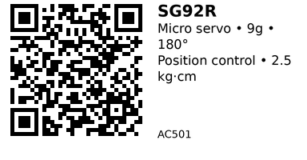

# SG92R Micro Servo - AC501

A tiny 9-gram micro servo (TowerPro SG92R) widely used in hobby robotics and small mechanisms. Rotates to commanded angles (0-180°) using standard servo PWM (~50 Hz) and provides modest torque for light linkages, knobs, and flaps. Stronger than SG90 (carbon fiber gears vs plastic), making it more durable for repeated use.

## Key Specifications

- **Operating Voltage**: 4.8V - 6.0V (5V typical)
- **Rotation Range**: 0° - 180° (position control)
- **Torque**: ~2.5 kg·cm @ 4.8V
- **Speed**: ~0.1 s / 60° @ 4.8V
- **Weight**: ~9g
- **Dimensions**: 23 × 12.2 × 27 mm (body)
- **Gear Material**: POM with carbon fiber (more durable than SG90)
- **Control Signal**: 50 Hz PWM, 500-2400 µs pulse width
- **Current**: 100-300 mA moving, ~650 mA stall

## Pinout

Standard 3-wire servo connector (color codes vary by vendor):

| Wire Color | Function |
|------------|----------|
| Brown/Black | GND |
| Red | +5V power |
| Orange/White | PWM signal |

## Wiring

### Basic Connection (ESP32)

```
External 5V Supply    SG92R Servo
--------------------  -----------
+5V               --> Red (+5V)
GND               --> Brown/Black (GND)

ESP32
-----
GPIO 18           --> Orange/White (Signal)
GND               --> Tied to servo supply GND
```

**Important:**

- Use **separate 5V supply** (≥1A per servo, not ESP32 3.3V pin)
- Tie ESP32 GND to servo supply GND (common ground)
- Add 470µF bulk capacitor near servo connector

## Usage Notes

### When to Use

**Use this servo when:**

- Need position control (0-180°) for flaps, arms, linkages
- Want stronger/more durable than SG90 (carbon fiber gears)
- Light-duty robotics (2.5 kg·cm torque sufficient)
- Standard hobby servo interface

**Don't use when:**

- Need continuous rotation (use AC503 SG90-360° instead)
- Need higher torque (>2.5 kg·cm) - consider larger servos
- Need precise positioning (<1° accuracy) - consider digital servos
- Powering from battery without regulation (servos need stable 5V)

### Common Issues

- **Jittery movement:** Insufficient power supply or loose wiring
- **Servo burns out:** Powered from ESP32 3.3V pin (use separate 5V supply!)
- **Stripped gears:** Commanding beyond 0-180° range or mechanical binding
- **Noise/EMI:** Keep signal wire short or twist with GND

## Code Examples

### Arduino/ESP32

```cpp
#include <ESP32Servo.h>

Servo servo;
const int SERVO_PIN = 18;

void setup() {
  ESP32PWM::allocateTimer(0);
  servo.setPeriodHertz(50);          // 50 Hz
  servo.attach(SERVO_PIN, 500, 2400); // min/max pulse (µs)
  servo.write(90);                    // center position
}

void loop() {
  // Sweep 0° to 180°
  for (int angle = 0; angle <= 180; angle += 5) {
    servo.write(angle);
    delay(20);
  }
  // Sweep back
  for (int angle = 180; angle >= 0; angle -= 5) {
    servo.write(angle);
    delay(20);
  }
}
```

**Libraries:**
- [ESP32Servo by Kevin Harrington](https://github.com/madhephaestus/ESP32Servo) - Servo control for ESP32

## Links

- [Datasheet: SG92R PDF](https://cdn-shop.adafruit.com/product-files/5592/C17481_SG92R_datasheet.pdf)
- [Purchase: TowerPro SG92R Micro Servo](https://www.aliexpress.com/item/1005007523412134.html)
- [Tutorial: ESP32 Servo Control (Random Nerd Tutorials)](https://randomnerdtutorials.com/esp32-servo-motor-web-server-arduino-ide/)

---


