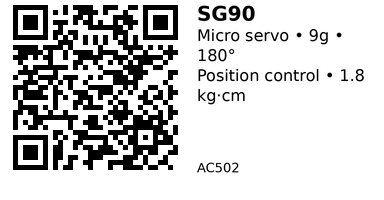

# SG90 Micro Servo (180°) - AC502

The most common 9g micro servo in hobby electronics. Controls position (0-180°) using standard PWM signals. Cheaper and lighter than SG92R but with lower torque and plastic gears. Perfect for learning, prototyping, and light-duty applications where durability isn't critical.

## Key Specifications

- **Operating Voltage**: 4.8V - 6.0V (5V typical)
- **Rotation Range**: 0° - 180° (position control)
- **Torque**: 1.8 kg·cm @ 4.8V, 2.0 kg·cm @ 6V
- **Speed**: ~0.1 s / 60° @ 4.8V
- **Weight**: ~9g
- **Dimensions**: 23 × 12.5 × 22 mm (body)
- **Gear Material**: Plastic (less durable than SG92R carbon fiber)
- **Control Signal**: 50 Hz PWM, 1000-2000 µs pulse width (1ms=0°, 1.5ms=90°, 2ms=180°)
- **Current**: ~10 mA idle, 110-250 mA moving, up to 300 mA stall

## Pinout

Standard 3-wire servo connector:

| Wire Color | Function |
|------------|----------|
| Brown/Black | GND |
| Red | +5V power |
| Orange/Yellow | PWM signal |

## Wiring

### Basic Connection (ESP32)

```
External 5V Supply    SG90 Servo
--------------------  ----------
+5V               --> Red (+5V)
GND               --> Brown (GND)

ESP32
-----
GPIO 18           --> Orange (Signal)
GND               --> Tied to servo supply GND
```

**Important:**
- Use **separate 5V supply** (≥1A per servo)
- Do NOT power from ESP32 3.3V pin
- Add 470µF bulk capacitor near servo connector

## Usage Notes

### When to Use

**Use this servo when:**

- Learning servo basics or prototyping
- Light-duty position control (1.8 kg·cm sufficient)
- Cost-sensitive projects (cheapest micro servo)
- Disposable/experimental applications

**Don't use when:**

- Need reliability (plastic gears strip easily under stress)
- Need continuous rotation (use AC503 SG90-360° instead)
- Want durability (use AC501 SG92R with carbon fiber gears instead)
- High torque required (>1.8 kg·cm)

### Common Issues

- **Plastic gears strip easily:** Don't overload or mechanically bind the servo
- **Inconsistent quality:** SG90 clones vary widely in quality by vendor
- **Jittery at endpoints:** Calibrate pulse width (some servos need 900-2100 µs instead of 1000-2000 µs)
- **Short lifespan:** Plastic gears wear out faster than metal/carbon fiber

## Code Examples

### Arduino/ESP32

```cpp
#include <ESP32Servo.h>

Servo servo;
const int SERVO_PIN = 18;

void setup() {
  ESP32PWM::allocateTimer(0);
  servo.setPeriodHertz(50);        // 50 Hz
  servo.attach(SERVO_PIN, 1000, 2000); // min/max pulse (µs)
  servo.write(90);                  // center
}

void loop() {
  servo.write(0);    // 0°
  delay(1000);
  servo.write(90);   // 90° (center)
  delay(1000);
  servo.write(180);  // 180°
  delay(1000);
}
```

**Libraries:**
- [ESP32Servo by Kevin Harrington](https://github.com/madhephaestus/ESP32Servo)

## Links

- [Datasheet: SG90 PDF](http://www.ee.ic.ac.uk/pcheung/teaching/DE1_EE/stores/sg90_datasheet.pdf)
- [Purchase: SG90 Servo (AliExpress)](https://www.aliexpress.com/w/wholesale-sg90-servo.html)
- [Tutorial: SG90 with ESP32 (ESPBoards)](https://www.espboards.dev/sensors/sg90/)
- [Tutorial: SG90 Basics (Components101)](https://components101.com/motors/servo-motor-basics-pinout-datasheet)

---


