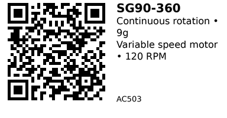

# SG90-360 Continuous Rotation Servo - AC503

A modified 9-gram SG90 servo for continuous rotation instead of position control. Acts like a variable-speed motor controlled by PWM: 1.5ms pulse = stop, shorter pulse = backward rotation, longer pulse = forward rotation. Useful for small wheeled robots, conveyor belts, or any application needing bidirectional motorized movement with simple PWM control.

## Key Specifications

- **Operating Voltage**: 4.8V - 6.0V (5V typical)
- **Rotation**: 360° continuous (NOT position control)
- **Speed**: 110 RPM @ 4.8V, 120 RPM @ 5V, 130 RPM @ 6V
- **Torque**: 1.3 kg·cm @ 4.8V, 1.5 kg·cm @ 6V
- **Weight**: ~9g
- **Dimensions**: 23 × 12.5 × 22 mm (body)
- **Gear Material**: Plastic or POM
- **Control Signal**: 50 Hz PWM, 1000-2000 µs pulse width
  - 1.5ms (1500 µs) = **STOP**
  - <1.5ms = **Backward rotation** (slower as pulse approaches 1ms)
  - >1.5ms = **Forward rotation** (faster as pulse approaches 2ms)
- **Current**: ~10 mA idle, 110-250 mA running, up to 300 mA stall

## Pinout

Standard 3-wire servo connector:

| Wire Color | Function |
|------------|----------|
| Brown/Black | GND |
| Red | +5V power |
| Orange/Yellow | PWM signal |

## Wiring

### Basic Connection (ESP32)

```
External 5V Supply    SG90-360 Servo
--------------------  --------------
+5V               --> Red (+5V)
GND               --> Brown (GND)

ESP32
-----
GPIO 18           --> Orange (Signal)
GND               --> Tied to servo supply GND
```

**Important:**

- Use **separate 5V supply** (≥1A per servo)
- Do NOT power from ESP32 3.3V pin
- Add 470µF bulk capacitor near servo connector

## Usage Notes

### When to Use

**Use this servo when:**

- Need bidirectional motorized rotation (wheels, conveyors, turrets)
- Want simple PWM speed control (no motor driver needed)
- Building small robots or mechanisms
- Need compact motor with built-in gearbox

**Don't use when:**

- Need position control (use AC502 SG90-180° or AC501 SG92R instead)
- Need precise speed control (servo speed varies with load)
- Need high torque (>1.5 kg·cm) - use larger motors
- Want true "stop" position (continuous rotation servos may drift slightly)

### Common Issues

- **Won't stop at 1.5ms:** Calibrate "stop" pulse width (varies by servo, try 1480-1520 µs)
- **Drifts when stopped:** Adjust PWM pulse to find true center point for your specific servo
- **Inconsistent speed:** Load on servo affects speed (not regulated like DC motors with encoders)
- **Direction reversed:** Swap pulse width (>1.5ms becomes backward if wired differently)

## Code Examples

### Arduino/ESP32

```cpp
#include <ESP32Servo.h>

Servo motor;
const int MOTOR_PIN = 18;

void setup() {
  ESP32PWM::allocateTimer(0);
  motor.setPeriodHertz(50);
  motor.attach(MOTOR_PIN, 1000, 2000);
  motor.writeMicroseconds(1500);  // STOP (calibrate if needed)
}

void loop() {
  // Forward (fast)
  motor.writeMicroseconds(2000);
  delay(2000);

  // Stop
  motor.writeMicroseconds(1500);  // Adjust if drifting (try 1480-1520)
  delay(1000);

  // Backward (fast)
  motor.writeMicroseconds(1000);
  delay(2000);

  // Stop
  motor.writeMicroseconds(1500);
  delay(1000);
}
```

### Variable Speed Control

```cpp
void setSpeed(int speed) {
  // speed: -100 (full backward) to +100 (full forward), 0 = stop
  int pulse = map(speed, -100, 100, 1000, 2000);
  motor.writeMicroseconds(pulse);
}

void loop() {
  // Slowly accelerate forward
  for (int spd = 0; spd <= 100; spd += 10) {
    setSpeed(spd);
    delay(200);
  }
  // Slowly decelerate
  for (int spd = 100; spd >= -100; spd -= 10) {
    setSpeed(spd);
    delay(200);
  }
}
```

**Libraries:**
- [ESP32Servo by Kevin Harrington](https://github.com/madhephaestus/ESP32Servo)

## Links

- [Datasheet: SG90 360° PDF](https://akizukidenshi.com/goodsaffix/sg90-hv.pdf)
- [Purchase: TowerPro SG90 360° Continuous Rotation Servo](https://www.aliexpress.com/item/1005006164455712.html)
- [Product Page: Tower Pro SG90-360](https://towerpro.com.tw/product/sg90-360-degree-continuous-rotation-servo/)

---


