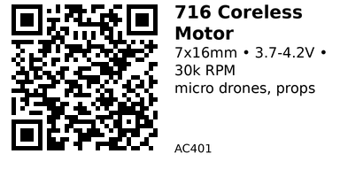

# 716 Coreless Brushed Motor (7x16mm, with propeller) - AC401

Ultra-lightweight coreless brushed motor designed for micro quadcopters and RC planes. High-speed rotation suitable for propeller-driven applications.

## Key Specifications

| Parameter | Value |
|-----------|-------|
| **Dimensions** | 7mm diameter x 16mm length |
| **Voltage** | 3.7V - 4.2V (1S LiPo) |
| **No-load speed** | ~30,000-35,000 RPM @ 3.7V |
| **No-load current** | ~0.4A |
| **Stall current** | ~2A (brief) |
| **Shaft diameter** | 0.8mm |
| **Motor type** | Brushed coreless |
| **Weight** | ~2g (motor only) |
| **Quantity** | 6 pieces |
| **Includes** | Propellers (55mm or 65mm typical) |

## Features

**Coreless design:**

- Very light weight
- Low inertia (fast acceleration)
- High efficiency
- Smooth rotation

**High speed:** Perfect for small propellers and high-RPM applications.

**Compact:** Fits into tight spaces on micro drones.

## Typical Wiring

**Power:** Connect to 1S LiPo (3.7-4.2V) via motor driver or ESC

```
Motor Driver (TB6612 or similar)
  OUT+ ----> Motor Red (+)
  OUT- ----> Motor Black (-)
```

**Never connect directly to GPIO** - use motor driver with H-bridge for speed/direction control.

## Quadcopter Wiring (4 motors)

For a micro quadcopter, use:

- **4x 716 motors** (AC401)
- **Motor driver module** (TB6612 dual = drives 2 motors, need 2x modules)
- **Flight controller** or ESP32 with PWM outputs
- **1S LiPo battery** (3.7V 250-350mAh)

```cpp
// Example: Control one motor via TB6612
#define MOTOR1_PWM  25
#define MOTOR1_IN1  26
#define MOTOR1_IN2  27

void setup() {
  pinMode(MOTOR1_IN1, OUTPUT);
  pinMode(MOTOR1_IN2, OUTPUT);

  ledcSetup(0, 25000, 8);  // 25kHz PWM
  ledcAttachPin(MOTOR1_PWM, 0);
}

void motor1_speed(uint8_t speed) {
  digitalWrite(MOTOR1_IN1, HIGH);
  digitalWrite(MOTOR1_IN2, LOW);
  ledcWrite(0, speed);  // 0-255
}

void motor1_stop() {
  digitalWrite(MOTOR1_IN1, LOW);
  digitalWrite(MOTOR1_IN2, LOW);
  ledcWrite(0, 0);
}
```

## Propeller Matching

Typically comes with:

- **55mm diameter** props (2-blade)
- **65mm diameter** props (3-blade or 4-blade)

**Thrust:** Small props generate ~10-20g thrust per motor at full speed.

**Prop direction:** For quadcopter, need 2x CW and 2x CCW propellers.

## Gotchas

1. **Voltage limit:** Do NOT exceed 4.2V (1S LiPo max voltage)
2. **Stall current:** Can spike to 2A - ensure driver can handle it
3. **Brush wear:** Coreless motors have shorter lifespan than brushless (~20-50 flight hours)
4. **Fragile shaft:** 0.8mm shaft is very thin - handle propellers carefully
5. **Direction:** No polarity marking - swap wires if rotation direction is wrong
6. **Heat:** Motor gets hot during extended high-speed operation

## Applications

**Micro quadcopters:** 4x motors for indoor flying

**RC planes:** Propeller drive for lightweight models

**Fans:** High-speed airflow (though not very efficient)

**Toy helicopters:** Rotor drive

## Maintenance

- **Replace brushes** when motor becomes sluggish (motor disassembly required)
- **Clean commutator** if motor sparks excessively
- **Check propeller balance** for smooth operation
- **Inspect shaft** for bending after crashes

## Compatible Components

**Drivers:** AC101 (TB6612), AC102 (L293D)

**Batteries:** PS203, PS204 (LiPo 3.7V 250-350mAh)

**Propellers:** 55mm or 65mm diameter (included with motor)

## Links

- **AliExpress**: [716 Coreless Motor 7x16mm with Propeller](https://www.aliexpress.com/item/1005006824316798.html)

---


