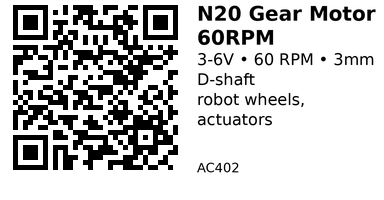

# N20 Gear Motor 60 RPM (3-6V, metal gearbox) - AC402

Compact DC gear motor with metal gearbox. Perfect for robot wheels, linear actuators, and precise positioning. Low speed, high torque.

## Key Specifications

| Parameter | Value |
|-----------|-------|
| **Motor type** | Brushed DC with metal gearbox |
| **Voltage** | 3V - 6V |
| **Gear ratio** | ~300:1 (approximate) |
| **Output speed** | 60 RPM @ 6V |
| **No-load current** | ~50mA @ 6V |
| **Stall current** | ~300mA @ 6V |
| **Stall torque** | ~0.3-0.5 kg·cm |
| **Shaft type** | 3mm D-shaft (flat on one side) |
| **Shaft length** | ~10mm |
| **Motor dimensions** | 10mm x 12mm gearbox, ~15mm total length |
| **Weight** | ~10g |
| **Quantity** | 5 pieces |

## Features

**Metal gearbox:**

- Durable construction
- Low noise
- Precise gearing

**High torque:** Gearing reduces speed but increases torque significantly.

**Compact:** Small form factor fits into tight spaces.

**D-shaft:** Flat side prevents wheel/coupler slipping.

## Pinout

2 solder pads on back:

- **Red wire**: Motor positive (+)
- **Black wire**: Motor negative (-)

**Polarity:** Reversible - swap wires to change rotation direction.

## Typical Wiring (Motor Driver)

```
Motor Driver (TB6612 or L293D)
  OUT1 ----> Motor Red (+)
  OUT2 ----> Motor Black (-)
```

**Speed control:** Use PWM on motor driver enable pin.

**Direction control:** Use driver's direction pins (IN1/IN2).

## Example Code (ESP32 + TB6612)

```cpp
// Motor control pins
#define PWM_PIN  25  // Speed control
#define IN1_PIN  26  // Direction 1
#define IN2_PIN  27  // Direction 2

void setup() {
  pinMode(IN1_PIN, OUTPUT);
  pinMode(IN2_PIN, OUTPUT);

  // Setup PWM (5kHz, 8-bit resolution)
  ledcSetup(0, 5000, 8);
  ledcAttachPin(PWM_PIN, 0);
}

void motor_forward(uint8_t speed) {
  digitalWrite(IN1_PIN, HIGH);
  digitalWrite(IN2_PIN, LOW);
  ledcWrite(0, speed);  // 0-255
}

void motor_reverse(uint8_t speed) {
  digitalWrite(IN1_PIN, LOW);
  digitalWrite(IN2_PIN, HIGH);
  ledcWrite(0, speed);
}

void motor_stop() {
  digitalWrite(IN1_PIN, LOW);
  digitalWrite(IN2_PIN, LOW);
  ledcWrite(0, 0);
}

void motor_brake() {
  digitalWrite(IN1_PIN, LOW);
  digitalWrite(IN2_PIN, LOW);
  ledcWrite(0, 255);  // Short brake
}
```

## Wheel Mounting

**D-shaft compatibility:** Requires wheels/couplers with 3mm D-shaft hole.

**Typical wheel sizes:** 32mm, 42mm, 60mm diameter

**Attachment:**

- Press-fit wheels onto D-shaft
- Use grub screw in wheel to lock onto flat side
- Or use hot glue for temporary projects

## Gotchas

1. **Voltage range:** Do not exceed 6V (gearbox damage risk)
2. **Stall current:** Can reach 300mA - ensure driver can handle it
3. **PWM frequency:** Keep PWM under 10kHz for smooth operation
4. **Backlash:** Small amount of gear backlash is normal
5. **Gear noise:** Metal gears produce some noise (quieter than plastic)
6. **Speed variation:** Actual RPM varies with load (60 RPM is no-load spec)

## Applications

**Robot wheels:** 2-wheel or 4-wheel drive robots

**Linear actuators:** With lead screw or rack-and-pinion

**Camera sliders:** Motorized pan/tilt mechanisms

**Conveyor belts:** Small-scale material handling

**Lock mechanisms:** Automated door locks or latches

## Speed/Torque Trade-off

**60 RPM version (this motor):**

- Good balance of speed and torque
- ~10cm diameter wheel = 19cm/s linear speed
- Suitable for most robot applications

**Other N20 variants available:**

- 100 RPM: Faster, less torque
- 30 RPM: Slower, more torque
- 300 RPM: Very fast, low torque

## Compatible Components

**Drivers:**

- AC101 (TB6612) - recommended for efficiency
- AC102 (L293D) - works but less efficient

**Wheels:** 32-60mm diameter with 3mm D-shaft hole

**Power:** 3-6V (can use 4x AA batteries, or 5V USB power)

## Links

- **AliExpress**: [N20 Mini Gear Motor 60RPM](https://www.aliexpress.com/item/1005005847467025.html)
- **Wheels**: [N20 Robot Wheels](https://www.aliexpress.com/w/wholesale-n20-motor-wheel.html)
- **Tutorial**: [Arduino Robot Car with N20 Motors](https://www.instructables.com/Arduino-Robot-Car-With-N20-Motors/)

---


