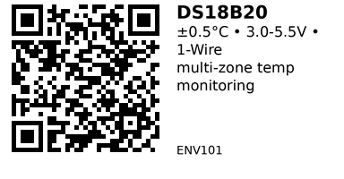

# DS18B20 1-Wire Digital Temperature Sensor - ENV101

Digital temperature sensor with 1-Wire interface and unique 64-bit ROM code. Perfect for multi-sensor applications where multiple temperature probes share a single GPIO pin. Available in TO-92 package or waterproof stainless steel probe.

## Key Specifications

| Parameter | Value |
|-----------|-------|
| **Temperature range** | -55°C to +125°C |
| **Accuracy** | ±0.5°C (-10°C to +85°C) |
| **Resolution** | 9-12 bit (0.0625°C at 12-bit) |
| **Supply voltage** | 3.0V - 5.5V |
| **Interface** | 1-Wire (single data wire) |
| **Conversion time** | 750ms (12-bit resolution) |
| **Package** | TO-92 or waterproof probe |
| **Operating mode** | Normal power or parasitic power |

## Pinout

**TO-92 Package** (flat face towards you, legs down):

```
   ___
  /   \
 |  D  |  DS18B20
  \___/
   | | |
   1 2 3

1 = GND (Ground)
2 = DQ (Data/Signal - 1-Wire)
3 = VDD (Power 3.0-5.5V)
```

**Waterproof Probe** (typical color codes - verify with meter!):

- **Red**: VDD (Power)
- **Yellow/White**: DQ (Data/Signal)
- **Black**: GND (Ground)

**Note:** Some cheap probes have wrong color codes - always verify with multimeter!

## Typical Wiring (ESP32)

```
ESP32           DS18B20        4.7kΩ Pull-up
-----           -------        --------------
3.3V   -------> VDD
              /
             /  4.7kΩ resistor
            /
GPIO 4 ----+---> DQ (Data)
GND    -------> GND
```

**Critical:** 4.7kΩ pull-up resistor from DQ to VDD is REQUIRED!

## Example Code (ESP32)

```cpp
// ESP32 + DS18B20 (Arduino)
// Install: OneWire + DallasTemperature libraries
#include <OneWire.h>
#include <DallasTemperature.h>

#define ONE_WIRE_BUS 4  // GPIO pin for 1-Wire bus

OneWire oneWire(ONE_WIRE_BUS);
DallasTemperature sensors(&oneWire);

void setup() {
  Serial.begin(115200);
  sensors.begin();
  sensors.setResolution(12);  // 12-bit = 0.0625°C resolution

  Serial.print("Found ");
  Serial.print(sensors.getDeviceCount());
  Serial.println(" sensor(s) on bus");
}

void loop() {
  sensors.requestTemperatures();  // Request temp from all sensors

  float tempC = sensors.getTempCByIndex(0);  // First sensor (index 0)

  if (tempC != DEVICE_DISCONNECTED_C) {
    Serial.print("Temperature: ");
    Serial.print(tempC);
    Serial.println(" °C");
  } else {
    Serial.println("Error: Sensor disconnected");
  }

  delay(2000);
}
```

## Multi-Sensor Example

Multiple DS18B20 on one bus (bus topology, not star):

```cpp
// Read multiple sensors by ROM address
DeviceAddress sensor1 = {0x28, 0xFF, 0x64, 0x1E, 0x60, 0x16, 0x03, 0xEC};
DeviceAddress sensor2 = {0x28, 0xAA, 0x5C, 0x2F, 0x60, 0x16, 0x04, 0x77};

void setup() {
  sensors.begin();

  // Set resolution per sensor
  sensors.setResolution(sensor1, 12);
  sensors.setResolution(sensor2, 12);
}

void loop() {
  sensors.requestTemperatures();

  float temp1 = sensors.getTempC(sensor1);
  float temp2 = sensors.getTempC(sensor2);

  Serial.printf("Sensor 1: %.2f°C | Sensor 2: %.2f°C\n", temp1, temp2);
  delay(2000);
}
```

## Key Features

**1-Wire bus topology:**

- Connect multiple sensors on same wire (tested up to 20-50 sensors)
- Each sensor has unique 64-bit ROM address
- Single GPIO pin controls entire bus

**Waterproof probes:**

- Stainless steel tube, epoxy sealed
- Cable lengths: 1m, 2m, 3m typical
- Perfect for outdoor/liquid/soil temperature

**Parasitic power mode:**

- Can be powered from data line (no VDD connection)
- More finicky, not recommended for beginners
- Use normal power mode when possible

## Gotchas

1. **Missing pull-up resistor:** Causes bogus 85°C or 127°C readings
2. **Wrong probe color codes:** Some cheap probes mislabel wires - verify with meter!
3. **Star wiring:** Use bus/backbone topology, not star (all sensors to one point)
4. **Conversion time:** 12-bit conversion takes 750ms - don't poll too fast
5. **Long cable runs:** Keep DQ and GND twisted pair, limit total bus length to ~100m
6. **Parasitic power:** Unreliable with multiple sensors or long cables - use normal power

## Wiring Best Practices

**Good (Bus topology):**
```
ESP32 ----+---- Sensor1 ----+---- Sensor2 ----+---- Sensor3
          |                 |                 |
        4.7kΩ              twisted pair (DQ + GND)
```

**Bad (Star topology):**
```
ESP32 ----+---- Sensor1
          |
          +---- Sensor2
          |
          +---- Sensor3
```

## Resolution Settings

| Bits | Resolution | Conversion Time |
|------|------------|-----------------|
| 9 | 0.5°C | 93.75 ms |
| 10 | 0.25°C | 187.5 ms |
| 11 | 0.125°C | 375 ms |
| 12 | 0.0625°C | 750 ms |

Higher resolution = slower but more precise.

## Applications

**Multi-zone HVAC:** Monitor temperature in different rooms on single wire.

**Aquarium/pond:** Waterproof probe for water temperature monitoring.

**Greenhouse:** Soil and air temperature sensing.

**Beer/wine brewing:** Precise fermentation temperature control.

**3D printer:** Heated bed and extruder temperature monitoring.

## Compatible Components

**Pull-up resistor:** 4.7kΩ (required, included with many probe kits)

**Libraries:**
- OneWire by Paul Stoffregen
- DallasTemperature by Miles Burton

## Links

- **AliExpress**: [DS18B20 Temperature Sensor](https://www.aliexpress.com/item/1005008644135794.html)
- **Datasheet**: [DS18B20 Datasheet (Analog Devices)](https://www.analog.com/media/en/technical-documentation/data-sheets/ds18b20.pdf)
- **Tutorial**: [ESP32 DS18B20 Guide (Random Nerd Tutorials)](https://randomnerdtutorials.com/esp32-ds18b20-temperature-arduino-ide/)

---


