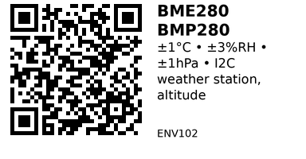

# BME280/BMP280 I2C Environmental Sensor - ENV102

All-in-one environmental sensor measuring temperature, humidity (BME280 only), and barometric pressure. Industry standard for weather stations and altitude measurement. Tiny I2C/SPI breakout module.

## Key Specifications

| Parameter | BME280 | BMP280 |
|-----------|--------|--------|
| **Temperature** | -40 to +85°C (±1°C) | -40 to +85°C (±1°C) |
| **Humidity** | 0-100% RH (±3%) | N/A (no humidity sensor) |
| **Pressure** | 300-1100 hPa (±1 hPa) | 300-1100 hPa (±1 hPa) |
| **Altitude accuracy** | ±1 meter | ±1 meter |
| **Supply voltage** | 1.71-3.6V (3.3V typical) | 1.71-3.6V (3.3V typical) |
| **Interface** | I2C or SPI | I2C or SPI |
| **I2C address** | 0x76 or 0x77 (SDO select) | 0x76 or 0x77 (SDO select) |
| **Current** | ~3.6μA (1 sample/s) | ~2.7μA (1 sample/s) |

**Critical difference:** BME280 has humidity sensor, BMP280 does NOT!

## Pinout (Common Breakout Modules)

**I2C Mode:**

- **VCC/3V3**: Power (3.3V)
- **GND**: Ground
- **SDA**: I2C data (ESP32 GPIO21 default)
- **SCL**: I2C clock (ESP32 GPIO22 default)
- **SDO**: Address select (LOW=0x76, HIGH=0x77)
- **CSB**: Chip select (tie HIGH for I2C mode)

**SPI Mode** (some boards):

- **CSB**: Chip select
- **SCK**: SPI clock
- **SDI/MOSI**: SPI data in
- **SDO/MISO**: SPI data out

## Typical Wiring (ESP32 I2C)

```
ESP32           BME280/BMP280
-----           -------------
3.3V   -------> VCC
GND    -------> GND
GPIO21 -------> SDA
GPIO22 -------> SCL
               SDO -----> GND (for 0x76 address)
                    or --> 3.3V (for 0x77 address)
```

**Pull-ups:** Most breakout modules have built-in 10kΩ I2C pull-ups.

## Example Code (ESP32 + Arduino)

```cpp
// ESP32 + BME280/BMP280 (I2C)
// Install: Adafruit BME280 + Adafruit BMP280 + Adafruit Unified Sensor
#include <Wire.h>
#include <Adafruit_BME280.h>
#include <Adafruit_BMP280.h>

Adafruit_BME280 bme;  // BME280 object
Adafruit_BMP280 bmp;  // BMP280 object

bool hasBME = false;
bool hasBMP = false;

void setup() {
  Serial.begin(115200);
  Wire.begin();  // Use default pins (21=SDA, 22=SCL)

  // Try BME280 first
  if (bme.begin(0x76) || bme.begin(0x77)) {
    hasBME = true;
    Serial.println("BME280 found (Temp + Humidity + Pressure)");

    // Configure sampling
    bme.setSampling(Adafruit_BME280::MODE_NORMAL,
                    Adafruit_BME280::SAMPLING_X2,   // Temp
                    Adafruit_BME280::SAMPLING_X2,   // Humidity
                    Adafruit_BME280::SAMPLING_X4,   // Pressure
                    Adafruit_BME280::FILTER_X4);
  }
  // Try BMP280 if BME280 not found
  else if (bmp.begin(0x76) || bmp.begin(0x77)) {
    hasBMP = true;
    Serial.println("BMP280 found (Temp + Pressure only, no humidity)");

    bmp.setSampling(Adafruit_BMP280::MODE_NORMAL,
                    Adafruit_BMP280::SAMPLING_X2,   // Temp
                    Adafruit_BMP280::SAMPLING_X4,   // Pressure
                    Adafruit_BMP280::FILTER_X4);
  }
  else {
    Serial.println("ERROR: No sensor found at 0x76 or 0x77!");
    while(1);
  }
}

void loop() {
  if (hasBME) {
    float temp = bme.readTemperature();         // °C
    float humidity = bme.readHumidity();        // %
    float pressure = bme.readPressure() / 100;  // hPa (divide by 100 for hPa)
    float altitude = bme.readAltitude(1013.25); // meters (sea level = 1013.25 hPa)

    Serial.printf("Temp: %.1f°C | Humidity: %.1f%% | Pressure: %.1f hPa | Alt: %.0f m\n",
                  temp, humidity, pressure, altitude);
  }
  else if (hasBMP) {
    float temp = bmp.readTemperature();
    float pressure = bmp.readPressure() / 100;
    float altitude = bmp.readAltitude(1013.25);

    Serial.printf("Temp: %.1f°C | Pressure: %.1f hPa | Alt: %.0f m\n",
                  temp, pressure, altitude);
  }

  delay(2000);
}
```

## Key Features

**BME280 advantages:**

- All-in-one: Temperature + Humidity + Pressure
- Perfect for weather stations
- Indoor air quality monitoring
- Greenhouse/terrarium control

**BMP280 (no humidity):**

- Temperature + Pressure only
- Slightly lower power consumption
- Good enough for altitude/barometer-only applications

**Altitude measurement:**

- Calculates altitude from barometric pressure
- ±1 meter accuracy (with calibration)
- Requires known sea-level pressure for your location

## Gotchas

1. **Clone confusion:** Many boards labeled "BME280" actually have BMP280 chip (no humidity!)
   - Check chip ID: BME280 = 0x60, BMP280 = 0x58
   - If humidity reads 0 or NaN, you likely have BMP280

2. **I2C address:** Default is usually 0x76, but some boards use 0x77
   - Try both addresses in code: `bme.begin(0x76) || bme.begin(0x77)`
   - SDO pin controls address: LOW=0x76, HIGH=0x77

3. **3.3V only:** Most breakouts are 3.3V ONLY (no 5V tolerance)
   - Check if your board has voltage regulator/level shifter
   - Feeding 5V can damage sensor

4. **Condensation:** For accurate humidity, avoid moisture condensation on sensor
   - Use vented enclosure for outdoor use
   - Allow airflow around sensor

5. **Calibration data:** Sensor stores calibration in ROM, read automatically by library
   - Don't need manual calibration for basic use
   - For precision work, calibrate against known reference

## Pressure Units Conversion

| hPa (mbar) | kPa | PSI | mmHg | inHg |
|------------|-----|-----|------|------|
| 1013.25 | 101.325 | 14.70 | 760 | 29.92 |

**Standard sea level pressure:** 1013.25 hPa (29.92 inHg)

## Altitude Calculation

Formula: `altitude = 44330 * (1 - (pressure/seaLevelPressure)^0.1903)`

**For accurate altitude:**
1. Get current sea-level pressure for your location (from weather station)
2. Pass to `readAltitude()` function
3. Or calibrate: measure pressure at known altitude

## Applications

**Weather station:** Track temperature, humidity, and barometric pressure trends.

**Altitude measurement:** Drones, RC planes, hiking altimeters.

**Indoor air quality:** Monitor temperature and humidity for comfort/mold prevention.

**Greenhouse automation:** Precise environmental control for plants.

**HVAC control:** Room climate monitoring and control.

## Compatible Components

**Libraries:**
- Adafruit BME280 Library (Arduino)
- Adafruit BMP280 Library (Arduino)
- Adafruit Unified Sensor (dependency)

**Alternative sensors:**
- ENV104 (SHT45): Better humidity accuracy, no pressure
- ENV101 (DS18B20): Temperature only, waterproof available

## Troubleshooting

**"Sensor not found" error:**
- Check I2C wiring (SDA/SCL swapped?)
- Try both addresses (0x76 and 0x77)
- Check power (3.3V, not 5V)
- Try lower I2C speed: `Wire.setClock(100000);`

**Humidity reads 0 or NaN:**
- You have BMP280, not BME280 (no humidity sensor)
- Use BMP280 library instead

**Readings seem wrong:**
- Allow sensor to stabilize (30 seconds after power-on)
- Check for condensation on sensor
- Verify sea-level pressure for altitude calc

## Links

- **AliExpress**: [BME280/BMP280 I2C Module](https://www.aliexpress.com/item/1005007274304296.html)
- **Datasheet**: [BME280 Datasheet (Bosch)](https://www.bosch-sensortec.com/media/boschsensortec/downloads/datasheets/bst-bme280-ds002.pdf)
- **Datasheet**: [BMP280 Datasheet (Bosch)](https://www.bosch-sensortec.com/media/boschsensortec/downloads/datasheets/bst-bmp280-ds001.pdf)
- **Tutorial**: [ESP32 BME280 Guide (Random Nerd Tutorials)](https://randomnerdtutorials.com/esp32-bme280-arduino-ide-pressure-temperature-humidity/)

---


