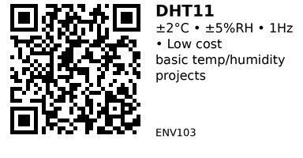

# DHT11 Temperature & Humidity Sensor - ENV103

Budget-friendly digital temperature and humidity sensor with single-wire interface. Good enough for basic projects but slow (1 reading/second) and less accurate than modern alternatives. Very popular in starter kits.

## Key Specifications

| Parameter | Value |
|-----------|-------|
| **Temperature range** | 0°C to 50°C |
| **Temperature accuracy** | ±2°C |
| **Humidity range** | 20% to 90% RH |
| **Humidity accuracy** | ±5% RH |
| **Resolution** | 1°C, 1% RH (integer only) |
| **Sampling rate** | 1 Hz (1 reading per second max) |
| **Supply voltage** | 3.3V - 5.5V |
| **Interface** | Single-wire digital (not true 1-Wire) |
| **Response time** | ~2 seconds |

## Pinout

**DHT11 Sensor (4-pin or 3-pin module):**

```
4-pin bare sensor:          3-pin module:
  ___                         ___
 |   |                       |   |
 | D |  DHT11                | D |  DHT11
 |___|                       |___|
 | | | |                     | | |
 1 2 3 4                     S + -

1 = VCC (3.3-5.5V)          S = Signal/Data
2 = Data                    + = VCC (3.3-5.5V)
3 = Not connected           - = GND
4 = GND
```

**Module version** often has built-in pull-up resistor and power LED.

## Typical Wiring (ESP32)

```
ESP32           DHT11
-----           -----
3.3V   -------> VCC (+)
GND    -------> GND (-)
GPIO 4 -------> Data (S)
         |
       10kΩ pull-up (if not on module)
         |
       3.3V
```

**Note:** Most breakout modules have built-in 10kΩ pull-up resistor.

## Example Code (ESP32)

```cpp
// ESP32 + DHT11
// Install: DHT sensor library by Adafruit + Adafruit Unified Sensor
#include <DHT.h>

#define DHTPIN 4        // GPIO pin connected to DHT11
#define DHTTYPE DHT11   // DHT11 sensor type

DHT dht(DHTPIN, DHTTYPE);

void setup() {
  Serial.begin(115200);
  dht.begin();
  Serial.println("DHT11 sensor initialized");
}

void loop() {
  // Wait 2 seconds between readings (DHT11 is slow)
  delay(2000);

  float humidity = dht.readHumidity();        // %
  float tempC = dht.readTemperature();        // °C
  float tempF = dht.readTemperature(true);    // °F

  // Check if readings failed
  if (isnan(humidity) || isnan(tempC)) {
    Serial.println("Failed to read from DHT11!");
    return;
  }

  // Calculate heat index (feels-like temperature)
  float heatIndexC = dht.computeHeatIndex(tempC, humidity, false);

  Serial.printf("Temp: %.1f°C | Humidity: %.1f%% | Heat Index: %.1f°C\n",
                tempC, humidity, heatIndexC);
}
```

## Key Features

**Advantages:**

- Very cheap (~$1-2)
- Simple single-wire interface
- 3.3V and 5V compatible
- No calibration needed
- Easy to use libraries

**Disadvantages:**

- Slow: Only 1 reading per second
- Low accuracy: ±2°C, ±5% RH
- Integer resolution only (no decimals)
- Limited range: 0-50°C, 20-90% RH
- 2 second response time

## Gotchas

1. **Slow sampling:** Must wait 2 seconds between readings (or sensor returns NaN)
2. **Integer only:** Returns whole numbers, no decimal precision
3. **Limited range:** Doesn't work below 0°C or above 50°C
4. **Humidity range:** Only accurate 20-90% RH (not full 0-100%)
5. **Pull-up required:** Needs 10kΩ pull-up on data line (usually on module)
6. **Not 1-Wire:** Uses custom protocol, not Dallas 1-Wire (different from DS18B20)

## DHT11 vs DHT22

| Feature | DHT11 | DHT22 (AM2302) |
|---------|-------|----------------|
| **Temp range** | 0-50°C | -40 to 80°C |
| **Temp accuracy** | ±2°C | ±0.5°C |
| **Humidity range** | 20-90% | 0-100% |
| **Humidity accuracy** | ±5% | ±2% |
| **Resolution** | 1°C, 1% | 0.1°C, 0.1% |
| **Price** | $1-2 | $3-5 |

**Recommendation:** If you need better accuracy, use DHT22 or modern I2C sensors (ENV102, ENV104).

## Applications

**Basic projects:** Room temperature/humidity display for learning.

**Starter kits:** Included in most Arduino/ESP32 starter kits.

**Non-critical monitoring:** Where ±2°C accuracy is acceptable.

**Budget projects:** When cost is more important than precision.

## When NOT to Use

- **Precision required:** Use ENV104 (SHT45) or ENV102 (BME280)
- **Fast sampling:** Use I2C sensors (can sample multiple times/second)
- **Outdoor use:** Use ENV101 (DS18B20) for wider temperature range
- **Humidity <20% or >90%:** Use better sensor like DHT22 or SHT45

## Troubleshooting

**Sensor returns NaN:**
- Check wiring (data pin correct?)
- Add/check 10kΩ pull-up resistor
- Wait 2+ seconds between readings
- Sensor may be dead (DHT11 has short lifespan)

**Readings seem stuck:**
- Power cycle sensor
- Check for loose connections
- Replace sensor (DHT11 reliability issues common)

## Links

- **AliExpress**: Search "DHT11 module" (very common, $1-2)
- **Library**: DHT sensor library by Adafruit (Arduino Library Manager)
- **Tutorial**: [ESP32 DHT11 Guide (Random Nerd Tutorials)](https://randomnerdtutorials.com/esp32-dht11-dht22-temperature-humidity-sensor-arduino-ide/)

---


