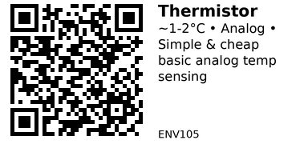

# NTC Thermistor Temperature Sensor (Analog) - ENV105

Simple and cheap analog temperature sensor using NTC (Negative Temperature Coefficient) thermistor. Resistance decreases as temperature increases. Requires ADC and calibration but very cost-effective for basic temperature sensing.

## Key Specifications

| Parameter | Value (typical 10kΩ NTC) |
|-----------|---------------------------|
| **Resistance @ 25°C** | 10kΩ (varies by model) |
| **Temperature range** | -50°C to +150°C (typical) |
| **Accuracy** | ~1-2°C (with calibration) |
| **Response time** | Fast (~1-5 seconds in air) |
| **Beta coefficient** | 3950K (typical, varies) |
| **Interface** | Analog (resistor divider) |
| **Power** | Passive (no active power) |
| **Cost** | Very cheap (~$0.10-0.50) |

**Note:** From fun kit - exact specs unknown, typical values shown.

## How NTC Thermistors Work

**NTC = Negative Temperature Coefficient**

- Resistance DECREASES when temperature INCREASES
- Non-linear resistance-temperature curve
- Requires voltage divider + ADC to measure
- Beta coefficient (β) determines curve steepness

## Typical Wiring (ESP32)

```
3.3V
  |
  +--- 10kΩ fixed resistor ---+--- GPIO34 (ADC pin)
                               |
                          Thermistor
                               |
                              GND
```

**Voltage divider:** Fixed resistor (10kΩ) + Thermistor (10kΩ @ 25°C)

At 25°C: V_out = 3.3V × (10k / (10k + 10k)) = 1.65V

## Example Code (ESP32)

```cpp
// ESP32 + 10kΩ NTC Thermistor
#define THERMISTOR_PIN 34   // ADC pin
#define SERIES_RESISTOR 10000  // 10kΩ fixed resistor
#define THERMISTOR_NOMINAL 10000  // 10kΩ @ 25°C
#define TEMPERATURE_NOMINAL 25  // 25°C
#define BETA_COEFFICIENT 3950  // Beta value (check datasheet)

void setup() {
  Serial.begin(115200);
  analogSetAttenuation(ADC_11db);  // 0-3.3V range
}

void loop() {
  // Read ADC value
  int adc = analogRead(THERMISTOR_PIN);

  // Convert ADC to voltage (12-bit ADC, 0-4095)
  float voltage = (adc / 4095.0) * 3.3;

  // Calculate thermistor resistance
  float resistance = SERIES_RESISTOR * voltage / (3.3 - voltage);

  // Steinhart-Hart equation (simplified Beta formula)
  float steinhart;
  steinhart = resistance / THERMISTOR_NOMINAL;     // (R/Ro)
  steinhart = log(steinhart);                      // ln(R/Ro)
  steinhart /= BETA_COEFFICIENT;                   // 1/B * ln(R/Ro)
  steinhart += 1.0 / (TEMPERATURE_NOMINAL + 273.15); // + (1/To)
  steinhart = 1.0 / steinhart;                     // Invert
  steinhart -= 273.15;                             // Convert to °C

  Serial.printf("ADC: %d | Voltage: %.2fV | Resistance: %.0fΩ | Temp: %.1f°C\n",
                adc, voltage, resistance, steinhart);

  delay(1000);
}
```

## Calibration

**Basic calibration (2-point):**

1. **Ice water (0°C):** Measure ADC value
2. **Boiling water (100°C):** Measure ADC value
3. Calculate actual Beta coefficient from measurements
4. Update `BETA_COEFFICIENT` in code

**Better calibration (3-point):**

- 0°C (ice water)
- 25°C (room temp with thermometer)
- 100°C (boiling water)

Use Steinhart-Hart calculator online with 3 points for best accuracy.

## Key Features

**Advantages:**

- Very cheap (pennies per sensor)
- Simple circuit (just resistor + thermistor)
- Fast response time
- Wide temperature range (-50 to +150°C)
- No special protocols or libraries

**Disadvantages:**

- Non-linear (requires calculation)
- Needs calibration for accuracy
- Lower precision than digital sensors
- Beta coefficient varies between units
- No humidity measurement

## Gotchas

1. **Non-linear:** Temperature-resistance curve is exponential (needs math)
2. **Self-heating:** Current through thermistor heats it slightly (~0.1°C error)
3. **Beta value:** Exact Beta coefficient varies - measure for calibration
4. **ADC noise:** ESP32 ADC can be noisy - average multiple readings
5. **Series resistor:** Match to thermistor nominal resistance (both 10kΩ)
6. **Unknown specs:** Fun kit thermistors may not have datasheet - calibrate!

## Choosing Series Resistor

**Rule:** Use fixed resistor = thermistor resistance @ midpoint temperature

Example: 10kΩ @ 25°C thermistor → use 10kΩ series resistor

This maximizes sensitivity around your target temperature range.

## Improving Accuracy

**Average multiple readings:**

```cpp
float readTemp() {
  float sum = 0;
  for (int i = 0; i < 10; i++) {
    sum += analogRead(THERMISTOR_PIN);
    delay(10);
  }
  float avg = sum / 10.0;
  // ... convert avg to temperature
}
```

**External ADC:** Use ADS1115 (16-bit) for better resolution than ESP32 (12-bit).

**Better calculation:** Use full Steinhart-Hart equation (3 coefficients) instead of simplified Beta formula.

## Thermistor Types

| Type | Resistance Change | Common Use |
|------|-------------------|------------|
| **NTC** | ↓ as temp ↑ | Temperature sensing (most common) |
| **PTC** | ↑ as temp ↑ | Overcurrent protection |

This is NTC (most common for temperature sensing).

## Applications

**Basic temperature monitoring:** Simple projects where ±1-2°C accuracy OK.

**3D printer:** Hotend/heated bed temperature (with PID control).

**HVAC:** Basic room temperature sensing.

**Battery monitoring:** Detect overheating in battery packs.

**Refrigerator:** Monitor fridge/freezer temperature.

## When to Use vs Digital Sensors

**Use thermistor when:**
- Cost is critical (very cheap)
- Simple circuit preferred
- Fast response needed
- Humidity not needed
- ±1-2°C accuracy acceptable

**Use digital sensor when:**
- Need ±0.5°C or better accuracy
- Want humidity measurement
- Prefer no calibration
- Need multiple sensors on one wire (1-Wire/I2C)

## Troubleshooting

**Readings seem wrong:**
- Check Beta coefficient (may be wrong)
- Calibrate against known temperature
- Verify series resistor value (10kΩ?)
- Check for loose connections

**Noisy readings:**
- Average multiple ADC samples
- Add 100nF capacitor across thermistor
- Use external ADC (ADS1115)

**No change with temperature:**
- Thermistor may be damaged (measure resistance with multimeter)
- Check wiring (voltage divider correct?)

## Links

- **Datasheet**: Search "10k NTC thermistor 3950" for similar specs
- **Calculator**: [Steinhart-Hart Calculator](https://www.thinksrs.com/downloads/programs/therm%20calc/ntccalibrator/ntccalculator.html)
- **Tutorial**: [Arduino Thermistor Guide](https://learn.adafruit.com/thermistor/using-a-thermistor)

---


