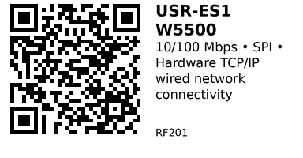

# USR-ES1 W5500 SPI Ethernet Module - RF201

SPI Ethernet module based on WIZnet W5500 chip. Features hardware TCP/IP stack, 10/100 Mbps Ethernet, and integrated magnetics with RJ45 connector. Perfect for adding reliable wired network connectivity to any microcontroller.

## Key Specifications

| Parameter | Value |
|-----------|-------|
| **Chip** | WIZnet W5500 |
| **Ethernet speed** | 10/100 Mbps (auto-negotiation) |
| **Interface** | SPI (up to 80 MHz) |
| **TCP/IP stack** | Hardware (on-chip) |
| **Sockets** | 8 independent hardware sockets |
| **Buffer** | 32KB (16KB TX + 16KB RX) |
| **Supply voltage** | 3.0V - 3.6V (module: 3.3V or 5V) |
| **Current** | ~132mA (active), ~15mA (power-down) |
| **Operating temp** | -40°C to +85°C |
| **Connector** | RJ45 with integrated magnetics |

## How It Works

**Hardware TCP/IP stack:**
- W5500 chip handles all network protocols in hardware
- No software TCP/IP stack needed on MCU
- MCU communicates via simple SPI commands
- Greatly reduces MCU load and code complexity

**Independent sockets:**
- 8 simultaneous TCP or UDP connections
- Each socket has its own buffer
- Can act as server, client, or both

## Pinout (USR-ES1 Module)

```
USR-ES1 Module
   ____________
  | RJ45       |  Ethernet connector
  |   []       |
  |____________|
   | | | | | | |
   V G S S S S I
   C N C M I N R
   C D K O S T Q
           S O

VCC  = Power (3.3V or 5V)
GND  = Ground
SCK  = SPI Clock
MOSI = SPI Master Out Slave In
MISO = SPI Master In Slave Out
INT  = Interrupt output (optional)
IRQ  = Same as INT (some modules label differently)
```

**Some modules also have:**
```
RST  = Reset input (active LOW)
CS   = Chip Select (sometimes called SS)
```

## Typical Wiring (ESP32)

```
ESP32           USR-ES1 (W5500)
-----           ---------------
3.3V   -------> VCC
GND    -------> GND
GPIO18 -------> SCK
GPIO23 -------> MOSI
GPIO19 -------> MISO
GPIO5  -------> CS (or SS)
GPIO4  -------> RST (optional)
```

**Ethernet cable:** Connect to router/switch with standard Cat5e/Cat6 cable.

## Example Code (ESP32)

```cpp
// ESP32 + W5500 Ethernet
// Install: Ethernet library (built-in)
#include <SPI.h>
#include <Ethernet.h>

#define CS_PIN 5

byte mac[] = {0xDE, 0xAD, 0xBE, 0xEF, 0xFE, 0xED};

void setup() {
  Serial.begin(115200);

  Ethernet.init(CS_PIN);

  Serial.println("Connecting to network...");

  if (Ethernet.begin(mac)) {  // DHCP
    Serial.println("DHCP OK!");
  } else {
    Serial.println("DHCP failed!");
    return;
  }

  Serial.print("IP address: ");
  Serial.println(Ethernet.localIP());
}

void loop() {
  // Check link status
  if (Ethernet.linkStatus() == LinkOFF) {
    Serial.println("Ethernet cable disconnected");
  }

  delay(1000);
}
```

## Static IP Configuration

```cpp
void setup() {
  Serial.begin(115200);
  Ethernet.init(CS_PIN);

  // Set static IP instead of DHCP
  IPAddress ip(192, 168, 1, 100);
  IPAddress dns(192, 168, 1, 1);
  IPAddress gateway(192, 168, 1, 1);
  IPAddress subnet(255, 255, 255, 0);

  Ethernet.begin(mac, ip, dns, gateway, subnet);

  Serial.print("IP: ");
  Serial.println(Ethernet.localIP());
}
```

## Web Server Example

```cpp
EthernetServer server(80);

void setup() {
  // ... (Ethernet init code)
  server.begin();
  Serial.println("Web server started");
}

void loop() {
  EthernetClient client = server.available();

  if (client) {
    Serial.println("New client connected");

    while (client.connected()) {
      if (client.available()) {
        char c = client.read();

        // Simple HTTP response
        if (c == '\n') {
          client.println("HTTP/1.1 200 OK");
          client.println("Content-Type: text/html");
          client.println();
          client.println("<h1>Hello from ESP32 + W5500!</h1>");
          client.stop();
          break;
        }
      }
    }
  }
}
```

## HTTP Client (GET Request)

```cpp
void loop() {
  EthernetClient client;

  if (client.connect("example.com", 80)) {
    Serial.println("Connected to server");

    client.println("GET / HTTP/1.1");
    client.println("Host: example.com");
    client.println("Connection: close");
    client.println();

    while (client.connected()) {
      if (client.available()) {
        char c = client.read();
        Serial.write(c);
      }
    }

    client.stop();
  } else {
    Serial.println("Connection failed");
  }

  delay(10000);  // Wait 10 seconds before next request
}
```

## MAC Address

W5500 doesn't have built-in MAC address. You must assign one:

```cpp
// Use random but locally-administered MAC
byte mac[] = {
  0x02,  // Locally administered (bit 1 of first byte = 1)
  random(0xFF),
  random(0xFF),
  random(0xFF),
  random(0xFF),
  random(0xFF)
};
```

Or use fixed MAC (ensure uniqueness on your network):
```cpp
byte mac[] = {0xDE, 0xAD, 0xBE, 0xEF, 0xFE, 0xED};
```

## Key Features

**Hardware TCP/IP:**
- No software stack needed
- Reduces MCU code size
- Offloads network processing

**8 independent sockets:**
- Multiple simultaneous connections
- Mix TCP and UDP
- Server + client at same time

**Auto-negotiation:**
- Automatic 10/100 Mbps speed detection
- Auto-MDI/MDIX (crossover cable not needed)

**Low MCU load:**
- Hardware handles protocols
- SPI communication only
- MCU can focus on application

**Integrated magnetics:**
- Direct RJ45 connection
- No external transformers needed
- Compact design

## Gotchas

1. **No built-in MAC:** Must assign MAC address in code
2. **3.3V logic:** W5500 is 3.3V - check module has level shifting for 5V MCUs
3. **SPI speed:** W5500 supports up to 80 MHz, but long wires may require slower speed
4. **Power consumption:** ~132mA when active (consider for battery projects)
5. **Cable required:** Obviously needs Ethernet cable to router/switch
6. **Library compatibility:** Use Ethernet library (not Ethernet2 or Ethernet3)

## W5500 vs WiFi

| Feature | W5500 Ethernet (RF201) | ESP32 WiFi |
|---------|------------------------|------------|
| **Connection** | Wired (cable) | Wireless |
| **Reliability** | Excellent | Good (interference possible) |
| **Speed** | 10/100 Mbps | Up to 150 Mbps (real: ~20-50) |
| **Latency** | Very low | Higher (variable) |
| **Power** | ~132mA | ~160-260mA |
| **Setup** | Plug-and-play (DHCP) | Need SSID/password |
| **Mobility** | Fixed location | Mobile |

**Use Ethernet when:**
- Reliability critical
- Fixed installation
- No WiFi interference concerns
- PoE power desired
- Industrial environments

**Use WiFi when:**
- Mobility needed
- No cable access
- Temporary installation
- Many devices (no switch ports)

## Applications

**Home automation:** Wired backbone for smart home hubs.

**Industrial control:** PLCs, automation controllers, factory equipment.

**Server applications:** Data logging, web servers, MQTT brokers.

**Security systems:** IP cameras, access control, alarm panels.

**PoE devices:** With PoE module, power + data over single cable.

**Arduino Ethernet:** Add wired network to Arduino boards.

## Troubleshooting

**No link (link LED off):**
- Check cable connection
- Verify cable is good (test with PC)
- Check both ends connected
- Try different cable

**DHCP fails:**
- Router DHCP enabled?
- Check MAC address is valid
- Try static IP
- Check SPI wiring (SCK/MOSI/MISO/CS)

**Can't connect to internet:**
- Can ping gateway? (use Ethernet.gatewayIP())
- DNS working? (try IP address instead of hostname)
- Check firewall settings

**Intermittent connection:**
- SPI wires too long (add shorter wires)
- Reduce SPI clock speed
- Check power supply (needs clean 3.3V)
- Add decoupling capacitor (100nF) near VCC pin

## Links

- **AliExpress**: Search "USR-ES1 W5500 ethernet" (~$5-8)

---


