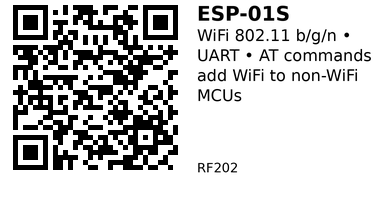

# ESP-01S ESP8266 WiFi Module - RF202

Compact WiFi module based on ESP8266 chip. Features UART interface with AT command firmware for adding WiFi connectivity to any microcontroller. Can also run standalone as IoT device.

## Key Specifications

| Parameter | Value |
|-----------|-------|
| **Chip** | ESP8266 (Espressif) |
| **WiFi** | 802.11 b/g/n (2.4 GHz only) |
| **Speed** | Up to 72 Mbps |
| **Interface** | UART (AT commands) |
| **Baud rate** | 115200 bps (default) |
| **Supply voltage** | 3.0V - 3.6V (3.3V typical) |
| **Current** | ~70mA (average), 170mA (peak TX) |
| **GPIO pins** | 2 exposed (GPIO0, GPIO2) |
| **Flash** | 1MB (ESP-01S) |
| **Range** | ~100m (open air) |

## Pinout

```
ESP-01S Module (top view)
    _______
   |  ESP  |
   | -01S  |
   |_______|
   | | | | |
   G T R V G
   N X X C N
   D   D C D

   | | | | |
   U R C G G
   0 S H P P
     T   I I
   E O O O
   N   2 0

GND  = Ground
TX   = UART TX (output from ESP, to MCU RX)
RX   = UART RX (input to ESP, from MCU TX)
VCC  = Power (3.3V only!)
GND  = Ground
CH_PD/EN = Chip enable (pull HIGH)
RST  = Reset (active LOW, pull HIGH normally)
GPIO0 = General purpose IO / Flash mode select
GPIO2 = General purpose IO
```

**Boot modes:**
- **Normal mode:** GPIO0 = HIGH during reset
- **Flash mode:** GPIO0 = LOW during reset (for programming)

## Typical Wiring (ESP32 or Arduino)

```
MCU             ESP-01S
---             -------
3.3V   -------> VCC (NEVER 5V!)
GND    -------> GND
TX     -------> RX (may need level shifter for 5V MCU)
RX     -------> TX
3.3V   -------> CH_PD (or EN)
3.3V   -------> GPIO0 (for normal operation)
         (via 10kΩ pull-up resistors)
```

**IMPORTANT:** ESP-01S is 3.3V only! Connecting 5V will damage it permanently.

## Example Code (ESP32 - Software Serial)

```cpp
// ESP32 controlling ESP-01S via AT commands
#include <SoftwareSerial.h>

#define ESP_RX 16  // ESP32 TX → ESP-01S RX
#define ESP_TX 17  // ESP32 RX → ESP-01S TX

SoftwareSerial esp8266(ESP_TX, ESP_RX);

void setup() {
  Serial.begin(115200);
  esp8266.begin(115200);

  delay(1000);

  // Test AT command
  sendCommand("AT", 1000);

  // Connect to WiFi
  sendCommand("AT+CWMODE=1", 1000);  // Station mode
  sendCommand("AT+CWJAP=\"YourSSID\",\"YourPassword\"", 10000);

  // Get IP address
  sendCommand("AT+CIFSR", 2000);
}

void loop() {
  // Echo responses
  while (esp8266.available()) {
    Serial.write(esp8266.read());
  }
}

void sendCommand(String cmd, int timeout) {
  esp8266.println(cmd);
  long start = millis();
  while (millis() - start < timeout) {
    while (esp8266.available()) {
      Serial.write(esp8266.read());
    }
  }
}
```

## Common AT Commands

**Basic:**
```
AT                  // Test connection
AT+RST              // Reset module
AT+GMR              // Get firmware version
AT+UART_DEF=115200,8,1,0,0  // Set baud rate (persistent)
```

**WiFi:**
```
AT+CWMODE=1         // Set station mode (1=STA, 2=AP, 3=both)
AT+CWJAP="SSID","password"  // Connect to AP
AT+CWQAP            // Disconnect from AP
AT+CIFSR            // Get IP address
AT+CWLAP            // List available APs
```

**TCP/IP:**
```
AT+CIPSTART="TCP","example.com",80  // Open TCP connection
AT+CIPSEND=10       // Send 10 bytes (then send data)
AT+CIPCLOSE         // Close connection
AT+CIPSERVER=1,80   // Start TCP server on port 80
```

## HTTP GET Request

```cpp
void httpGet() {
  // Connect to server
  sendCommand("AT+CIPSTART=\"TCP\",\"example.com\",80", 5000);
  delay(2000);

  // Prepare HTTP request
  String request = "GET / HTTP/1.1\r\nHost: example.com\r\n\r\n";

  // Send length
  String lengthCmd = "AT+CIPSEND=" + String(request.length());
  sendCommand(lengthCmd, 1000);
  delay(1000);

  // Send request
  esp8266.print(request);
  delay(2000);

  // Read response
  while (esp8266.available()) {
    Serial.write(esp8266.read());
  }

  // Close connection
  sendCommand("AT+CIPCLOSE", 1000);
}
```

## TCP Server (Web Server)

```cpp
void setupServer() {
  // Set multiple connections mode
  sendCommand("AT+CIPMUX=1", 1000);

  // Start server on port 80
  sendCommand("AT+CIPSERVER=1,80", 1000);

  Serial.println("Server started on port 80");
}

void loop() {
  // Wait for incoming connections
  // When data received, send HTTP response
  // (requires parsing +IPD data)
}
```

## Programming ESP-01S Directly

ESP-01S can run code directly (not just AT commands):

1. Connect GPIO0 to GND
2. Reset module
3. Upload code via Arduino IDE (select "Generic ESP8266 Module")
4. Disconnect GPIO0 from GND
5. Reset to run new code

**Note:** This erases AT firmware. To restore, flash AT firmware binary.

## Key Features

**Compact size:**
- Very small module
- Fits in tight spaces
- 8-pin DIP package

**Low cost:**
- Cheapest WiFi solution
- ~$1-2 per module

**Dual use:**
- AT command mode (WiFi-to-serial bridge)
- Standalone mode (program directly)

**AT command interface:**
- Simple UART communication
- No complex protocols
- Works with any MCU

## Gotchas

1. **3.3V only!** 5V will destroy module instantly
2. **High current:** Needs ~200mA peak (weak regulators will fail)
3. **Limited GPIO:** Only 2 GPIO pins exposed
4. **AT firmware varies:** Different manufacturers, different commands
5. **Baud rate:** Default 115200, some use 9600 (check with AT)
6. **Reset needed:** Sometimes AT commands stop working (requires reset)
7. **Better alternatives:** ESP32 has built-in WiFi + more features

## ESP-01S vs ESP32

| Feature | ESP-01S (RF202) | ESP32 Built-in WiFi |
|---------|-----------------|---------------------|
| **Use case** | Add WiFi to other MCU | Standalone WiFi+MCU |
| **Interface** | UART (AT commands) | Native code |
| **GPIO pins** | 2 | 30+ |
| **Cost** | $1-2 + MCU | $3-5 (no extra MCU) |
| **Complexity** | AT commands | Programming C/C++ |
| **Bluetooth** | No | Yes (BLE) |

**Use ESP-01S when:**
- Already have Arduino/other MCU
- Just need simple WiFi
- Limited budget
- Simple commands sufficient

**Use ESP32 directly when:**
- Starting new project
- Need more GPIO
- Want Bluetooth too
- More powerful MCU needed

## Common Use Cases

**Arduino WiFi:** Add WiFi to Arduino Uno, Nano (no built-in WiFi).

**Serial-to-WiFi bridge:** Wireless serial communication.

**IoT sensor:** Simple WiFi sensors (temperature, humidity).

**Home automation:** Wireless control of lights, relays.

**Data logger:** Send sensor data to cloud.

## Troubleshooting

**No response to AT commands:**
- Check baud rate (try 9600, 115200)
- Verify RX/TX not swapped
- CH_PD/EN pin HIGH?
- Power supply adequate (200mA capability)?

**Can't connect to WiFi:**
- SSID/password correct?
- 2.4 GHz network (not 5 GHz!)
- Signal strength sufficient?
- Reset and try again

**Random resets:**
- Power supply insufficient (needs 200mA)
- Add bulk capacitor (100-470µF) near VCC
- Check wiring (loose connections)

**AT firmware missing:**
- Was programmed with Arduino code
- Re-flash AT firmware from Espressif
- Or continue using as standalone ESP8266

## Links

- **AliExpress**: Search "ESP-01S ESP8266" (~$1-2)

---


