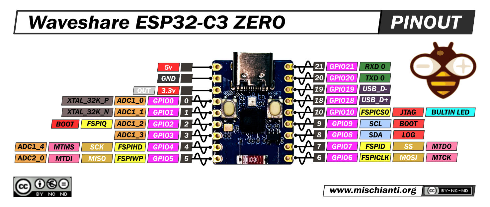
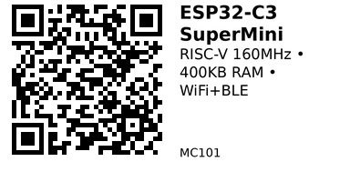

# ESP32-C3 SuperMini — MC101

**Aliases:** ESP32-C3 Super Mini, ESP32-C3-ZERO
**Category:** MC
**Family:** ESP32

## Quick Facts
- **CPU:** RISC-V single-core @ 160 MHz
- **Memory:** 400 KB SRAM, 384 KB ROM, 4 MB Flash
- **Wireless:** WiFi 802.11 b/g/n, Bluetooth 5.0 LE
- **GPIO:** 11 programmable GPIO
- **ADC:** 6 channels
- **PWM:** 11 channels
- **Communication:** 2× UART, 1× I2C, 3× SPI
- **Power:** 43 µA deep sleep
- **I/O Voltage:** 3.3V
- **Size:** 22.5 × 18 mm
- **USB:** Type-C (native USB, no external UART chip)

## Arduino Configuration
- **Board:** "ESP32C3 Dev Module"
- **FQBN:** `esp32:esp32:esp32c3`

## Links
- **Where to buy:** [AliExpress](https://www.aliexpress.com/item/1005006406538478.html)
- **Datasheet:** [ESP32-C3 Datasheet (PDF)](https://mischianti.org/wp-content/uploads/2023/05/esp32-c3_datasheet_en.pdf)
- **Schematic:** [Board Schematic (PDF)](https://mischianti.org/wp-content/uploads/2025/07/esp32-c3-supermini-schematics.pdf)

## Pinout
- **GPIO8:** Connected to inverted blue LED
- **GPIO9:** Connected to BOOT button
- **GPIO4-7:** Reserved for JTAG debugging
- **GPIO20:** UART0 RX (U0RXD)
- **GPIO21:** UART0 TX (U0TXD)

*(Credit: [mischianti.org](https://mischianti.org/esp32-c3-super-mini-high-resolution-pinout-datasheet-and-specs/))*

---

*QR for printing will appear here after you run the script:*

