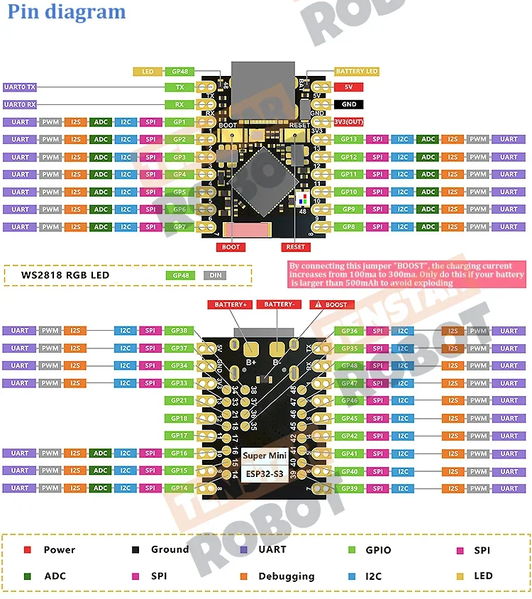
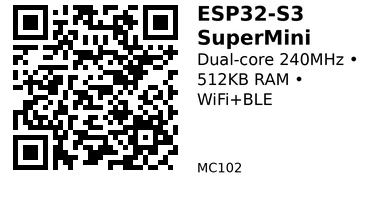

# ESP32-S3 SuperMini — MC102

**Aliases:** ESP32-S3 Super Mini
**Category:** MC
**Family:** ESP32

## Quick Facts
- **CPU:** Dual-core Xtensa LX7 @ 240 MHz
- **Memory:** 512 KB SRAM, 384 KB ROM, 4 MB Flash
- **Wireless:** WiFi 802.11 b/g/n, Bluetooth 5.0 LE
- **GPIO:** 11 digital I/O pins
- **ADC:** 6 analog input channels
- **PWM:** 11 PWM pins
- **Communication:** UART, I2C, SPI
- **Power:** 43 µA deep sleep
- **I/O Voltage:** 3.3V
- **Size:** 22.52 × 18 mm
- **USB:** Type-C with native USB (no external UART chip)
- **Special:** Onboard WS2812 RGB LED

## Arduino Configuration
- **Board:** "ESP32S3 Dev Module"
- **FQBN:** `esp32:esp32:esp32s3`

## Links
- **Where to buy:** [AliExpress](https://www.aliexpress.com/item/1005006406538478.html)
- **Datasheet:** [ESP32-S3 Datasheet (PDF)](https://www.espressif.com/sites/default/files/documentation/esp32-s3_datasheet_en.pdf)

## Pinout
- **Pin Gap:** 2.54 mm spacing
- **External Interrupts:** 22 pins capable
- **Security:** AES-128/256, RSA, HMAC encryption support

*(Credit: [espboards.dev](https://www.espboards.dev/esp32/esp32-s3-super-mini/))*

---

*QR for printing will appear here after you run the script:*

