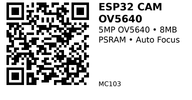

# ESP32 CAM OV5640 — MC103

**Aliases:** OV5640 ESP32-CAM
**Category:** MC
**Family:** ESP32

## Quick Facts
- **CPU:** Dual-core Xtensa LX6 @ 240 MHz (ESP-WROOM-32)
- **Memory:** 520 KB SRAM, 4 MB Flash, 8 MB PSRAM
- **Camera:** OV5640 5MP with Auto Focus
- **Lens Options:** 66°, 120°, 160° field of view
- **Wireless:** WiFi 802.11 b/g/n, Bluetooth Classic + BLE
- **I/O Voltage:** 3.3V
- **USB:** Type-C connector
- **MicroSD:** Card slot for storage

## Arduino Configuration
- **Board:** "AI Thinker ESP32-CAM"
- **FQBN:** `esp32:esp32:esp32cam`
- **Partition Scheme:** Huge APP (3MB No OTA/1MB SPIFFS)
- **PSRAM:** Enabled
- **CPU Frequency:** 240 MHz (WiFi/BT)

## Links
- **Where to buy:** [AliExpress](https://www.aliexpress.com/item/1005004227739159.html)
- **Datasheet:** [ESP32 Datasheet (PDF)](https://www.espressif.com/sites/default/files/documentation/esp32_datasheet_en.pdf)
- **Camera Datasheet:** [OV5640 Datasheet (PDF)](https://cdn.sparkfun.com/datasheets/Sensors/LightImaging/OV5640_datasheet.pdf)

## Camera GPIO Configuration
```
RESET_GPIO_NUM   5
XCLK_GPIO_NUM    15
SIOD_GPIO_NUM    22  (I2C SDA)
SIOC_GPIO_NUM    23  (I2C SCL)
D0_GPIO_NUM      2
D1_GPIO_NUM      14
D2_GPIO_NUM      35
D3_GPIO_NUM      12
D4_GPIO_NUM      27
D5_GPIO_NUM      33
D6_GPIO_NUM      34
D7_GPIO_NUM      39
VSYNC_GPIO_NUM   18
HREF_GPIO_NUM    36
PCLK_GPIO_NUM    26
LED_GPIO_NUM     25  (Flash LED)
```

---

*QR for printing will appear here after you run the script:*


