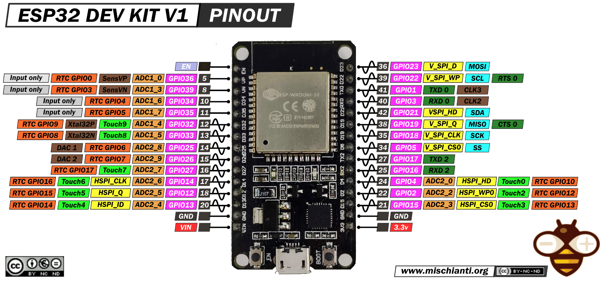
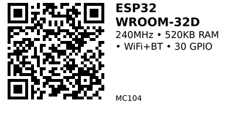

# ESP32 WROOM-32D DevKit — MC104

**Aliases:** ESP32 DevKit, ESP32-WROOM-32D, DOIT ESP32 DevKit v1
**Category:** MC
**Family:** ESP32

## Quick Facts
- **CPU:** Dual-core Xtensa LX6 @ 240 MHz (ESP-WROOM-32D)
- **Memory:** 520 KB SRAM, 4 MB Flash (32Mbit SPI)
- **Wireless:** WiFi 802.11 b/g/n (2.4 GHz), Bluetooth 4.2 BR/EDR + BLE
- **Frequency Range:** 2412-2484 MHz
- **Antenna:** Onboard PCB antenna (2 dBi gain)
- **GPIO:** 30 pins (some shared with strapping/boot pins)
- **ADC:** 18 channels (12-bit, 0-3.3V)
- **DAC:** 2 channels (8-bit)
- **Communication:** UART, SPI, SDIO, I2C, PWM, I2S, IR
- **I/O Voltage:** 3.3V
- **Power:** USB Type-C 5V
- **Serial Baud:** 115200 bps default
- **Size:** 54 × 28 × 10 mm

## Arduino Configuration
- **Board:** "ESP32 Dev Module"
- **FQBN:** `esp32:esp32:esp32`
- **Upload Speed:** 921600

## Links
- **Where to buy:** [AliExpress](https://www.aliexpress.com/item/1005008146728673.html)
- **Datasheet:** [ESP32 Datasheet (PDF)](https://www.espressif.com/sites/default/files/documentation/esp32_datasheet_en.pdf)
- **WROOM-32D Datasheet:** [ESP32-WROOM-32D Datasheet (PDF)](https://www.espressif.com/sites/default/files/documentation/esp32-wroom-32d_esp32-wroom-32u_datasheet_en.pdf)

## Pinout Details
- **Strapping Pins:** GPIO 0, 2, 5, 12, 15 (used during boot)
- **Input Only:** GPIO 34, 35, 36, 39 (no pull-up/pull-down)
- **Touch Sensors:** GPIO 0, 2, 4, 12, 13, 14, 15, 27, 32, 33
- **PWM:** All GPIO pins support PWM
- **SPI:** HSPI and VSPI available

## Pinout

*(Credit: [mischianti.org](https://mischianti.org))*

---

*QR for printing will appear here after you run the script:*

