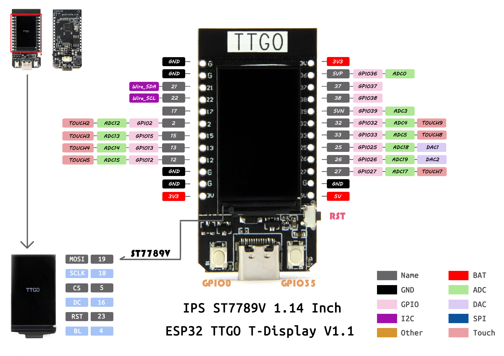
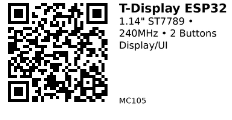

# LILYGO TTGO T-Display ESP32 — MC105

**Aliases:** LILYGO T-Display, TTGO T-Display, TENSTAR T-Display
**Category:** MC
**Family:** ESP32

## Quick Facts
- **CPU:** Dual-core Xtensa LX6 @ 240 MHz (ESP32)
- **Memory:** 520 KB SRAM, 4 MB Flash
- **Display:** 1.14" TFT LCD 135×240 pixels
- **Display Driver:** ST7789
- **Wireless:** WiFi 802.11 b/g/n, Bluetooth Classic + BLE
- **Buttons:** 2× programmable buttons (GPIO 0, GPIO 35)
- **I/O Voltage:** 3.3V
- **Power:** USB-C or battery connector (JST 1.25mm)
- **Battery:** Built-in battery management (TP4054)
- **Size:** Compact form factor

## Arduino Configuration
- **Board:** "ESP32 Dev Module"
- **FQBN:** `esp32:esp32:esp32`

## Links
- **Where to buy:** [AliExpress](https://www.aliexpress.com/item/1005005970553639.html)
- **Datasheet:** [ESP32 Datasheet (PDF)](https://www.espressif.com/sites/default/files/documentation/esp32_datasheet_en.pdf)
- **GitHub:** [LILYGO T-Display Repository](https://github.com/Xinyuan-LilyGO/TTGO-T-Display)

## Display GPIO
```
TFT_CS       5
TFT_DC       16
TFT_MOSI     19
TFT_SCLK     18
TFT_RST      23
TFT_BL       4   (backlight)
```

## Buttons & Power
```
BUTTON_1     0   (boot button)
BUTTON_2     35  (user button)
ADC_BAT      34  (battery voltage monitor)
```

## Available GPIO
- Most ESP32 GPIO broken out on side headers
- Some pins used by display and buttons

## Pinout


*(Credit: [LILYGO TTGO-T-Display](https://github.com/Xinyuan-LilyGO/TTGO-T-Display))*

---

*QR for printing will appear here after you run the script:*


