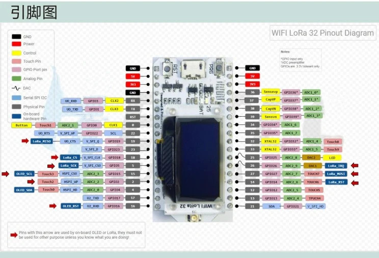
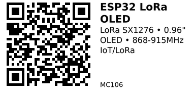

# ESP32 LoRa OLED SX1276 — MC106

**Aliases:** TTGO LoRa32, WiFi LoRa 32, Heltec WiFi LoRa 32
**Category:** MC
**Family:** ESP32

## Quick Facts
- **CPU:** Dual-core Tensilica Xtensa LX6 @ 240 MHz (ESP32)
- **Memory:** 520 KB SRAM, 4 MB Flash (32Mbit)
- **Computing Power:** Up to 600 DMIPS
- **Wireless:** WiFi 802.11 b/g/n, Bluetooth 4.2 BR/EDR + BLE
- **LoRa:** SX1276/SX1278 chipset
- **Frequency Bands:** 433 MHz, 868 MHz, 915 MHz
- **LoRa Range:** Up to 2.8 km (open field)
- **Receiver Sensitivity:** -139 dBm @ SF12, 125 kHz
- **TX Power:** 19.5 dBm @ 11b, 16.5 dBm @ 11g, 15.5 dBm @ 11n
- **Display:** 0.96" OLED (I2C)
- **Operating Voltage:** 3.3-7V
- **USB Adapter:** CP2102
- **I/O Voltage:** 3.3V

## Arduino Configuration
- **Board:** "TTGO LoRa32-OLED" or "Heltec WiFi LoRa 32"
- **FQBN:** `esp32:esp32:ttgo-lora32` or `esp32:esp32:heltec_wifi_lora_32`

## Links
- **Where to buy:** [AliExpress](https://www.aliexpress.com/item/1005005967763162.html)
- **Datasheet:** [ESP32 Datasheet (PDF)](https://www.espressif.com/sites/default/files/documentation/esp32_datasheet_en.pdf)
- **LoRa Datasheet:** [SX1276 Datasheet (PDF)](https://www.semtech.com/products/wireless-rf/lora-core/sx1276)

## LoRa GPIO
```
LORA_SCK     5
LORA_MISO    19
LORA_MOSI    27
LORA_CS      18
LORA_RST     14
LORA_DIO0    26
```

## OLED GPIO
```
OLED_SDA     4
OLED_SCL     15
OLED_RST     16
```

## Communication Specs
- **WiFi UDP Throughput:** 135 Mbps
- **WiFi Data Rate:** 150 Mbps @ 11n HT40, 72 Mbps @ 11n HT20, 54 Mbps @ 11g, 11 Mbps @ 11b
- **Operating Temp:** -40°C to +90°C

## Pinout


*(Credit: [AliExpress](https://www.aliexpress.com/item/1005005967763162.html))*

---

*QR for printing will appear here after you run the script:*


