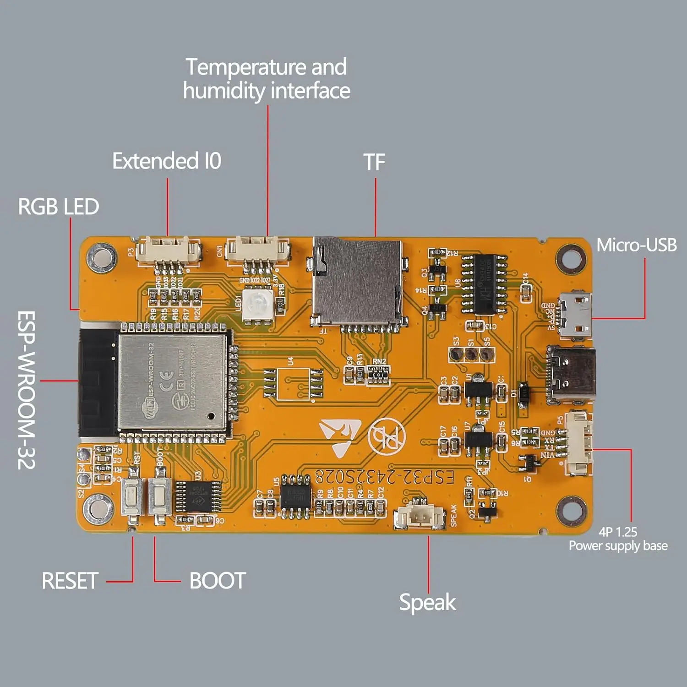
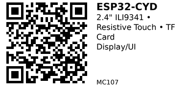

# ESP32-2432S028R — MC107

**Aliases:** Cheap Yellow Display (CYD), ESP32-2432S028R
**Category:** MC
**Family:** ESP32

## Quick Facts
- **CPU:** Dual-core Xtensa LX6 @ 240 MHz (ESP-WROOM-32)
- **Memory:** 520 KB SRAM, 4 MB Flash (32Mbit SPI)
- **Display:** 2.4" TFT LCD 240×320 pixels
- **Display Driver:** ILI9341
- **Touch:** Resistive touchscreen (XPT2046)
- **Wireless:** WiFi 802.11 b/g/n, Bluetooth Classic + BLE
- **Storage:** MicroSD card slot (max 4GB recommended)
- **Communication:** UART, SPI, I2C, PWM, I2S
- **I/O Voltage:** 3.3V
- **Power:** USB Type-C 5V or external power
- **Special:** Onboard RGB LED, LDR (light sensor)

## Arduino Configuration
- **Board:** "ESP32 Dev Module"
- **FQBN:** `esp32:esp32:esp32`
- **Partition Scheme:** Default 4MB with spiffs

## Links
- **Where to buy:** [AliExpress](https://www.aliexpress.com/item/1005008204991450.html)
- **Datasheet:** [ESP32 Datasheet (PDF)](https://www.espressif.com/sites/default/files/documentation/esp32_datasheet_en.pdf)
- **Display Driver:** [ILI9341 Datasheet (PDF)](https://cdn-shop.adafruit.com/datasheets/ILI9341.pdf)

## Display & Touch GPIO
```
TFT_CS       15
TFT_DC       2
TFT_MOSI     13
TFT_MISO     12
TFT_SCLK     14
TFT_RST      -1 (not connected)
TFT_BL       21  (backlight)

TOUCH_CS     33
TOUCH_IRQ    36
```

## Available GPIO
- **Expansion Connector:** GPIO 22, 27
- **Additional:** GPIO 35 (input only)
- **RGB LED:** GPIO 4 (Red), GPIO 16 (Green), GPIO 17 (Blue)
- **LDR:** GPIO 34 (analog input)

## Pinout


*(Credit: [AliExpress](https://www.aliexpress.com/item/1005008204991450.html))*

---

*QR for printing will appear here after you run the script:*


