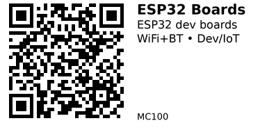

# ESP32 Development Boards - MC100

ESP32 microcontroller development boards with built-in WiFi and Bluetooth. Choose based on form factor (compact vs dev board), CPU architecture (RISC-V vs Xtensa), and special features (camera, display, extra memory).

## Key Boards Comparison

| Component | Chip | CPU | RAM | Flash | Special Features |
|-----------|------|-----|-----|-------|------------------|
| [MC101](MC101.md) | ESP32-C3 | RISC-V 160MHz | 400KB | 4MB | Ultra-compact, USB-C |
| [MC102](MC102.md) | ESP32-S3 | Dual Xtensa 240MHz | 512KB | 16MB | Compact, high performance |
| [MC103](MC103.md) | ESP32 | Xtensa 240MHz | 8MB PSRAM | 4MB | 5MP camera (OV5640) |
| [MC104](MC104.md) | ESP32 | Dual Xtensa 240MHz | 520KB | 4MB | Standard dev board, 30 GPIO |

See full component list below for additional boards.

## Selection Guide

**Compact projects:** MC101 (C3 SuperMini) or MC102 (S3 SuperMini) for small form factor with modern chips.

**Camera/vision:** MC103 (OV5640 camera module) for image capture and processing applications.

**General development:** MC104 (WROOM-32D DevKit) for breadboard-friendly prototyping with many exposed GPIO.

## Common Applications

**IoT sensors:** Any board works, but MC101/MC102 offer compact size and low power for battery projects.

**Camera projects:** MC103 for security cameras, QR code readers, or image-based ML applications.

**WiFi control:** Standard MC104 for home automation, web servers, or MQTT-based systems.

---

## Components in This Family

{{ children() }}

---

*QR for printing will appear here after you run the script:*

